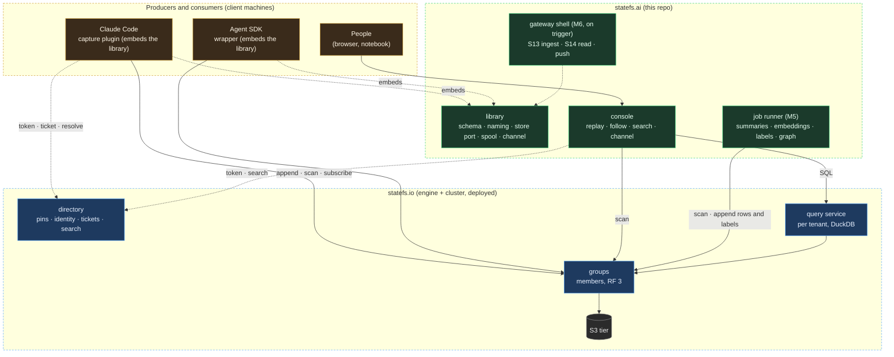
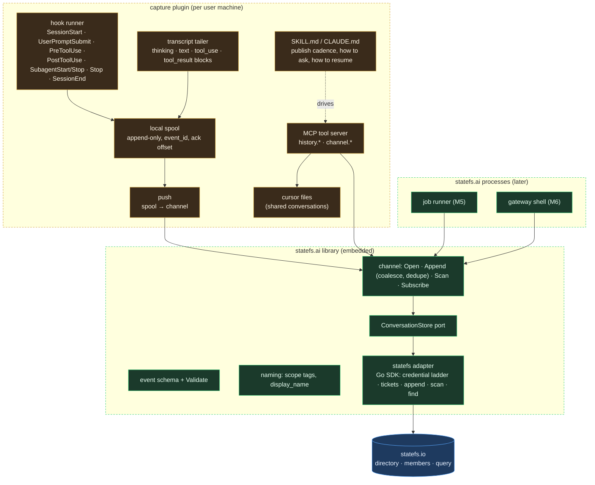
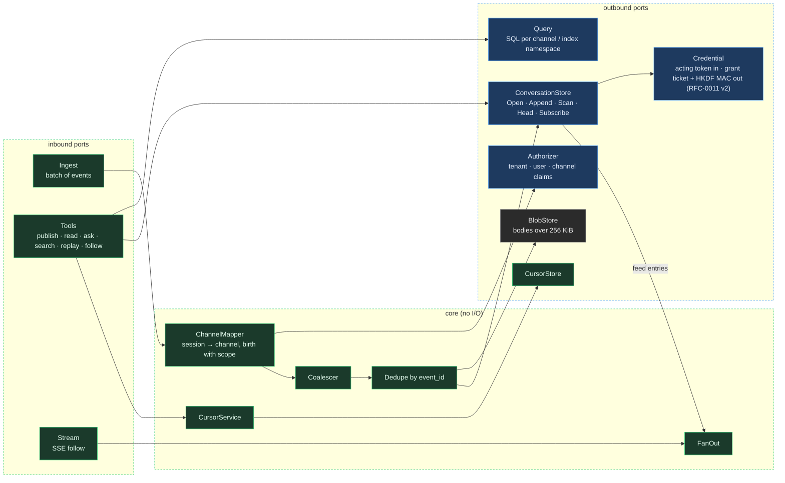
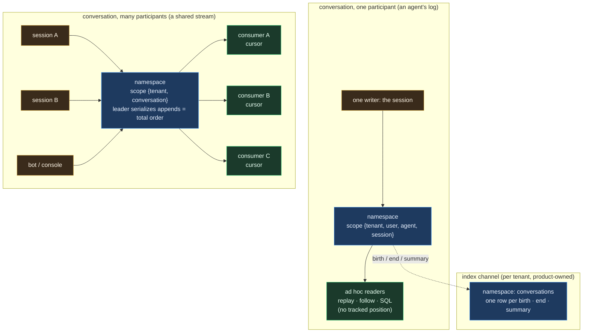
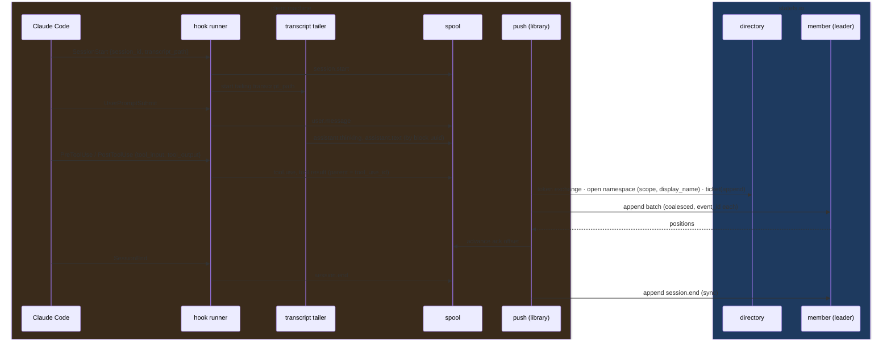
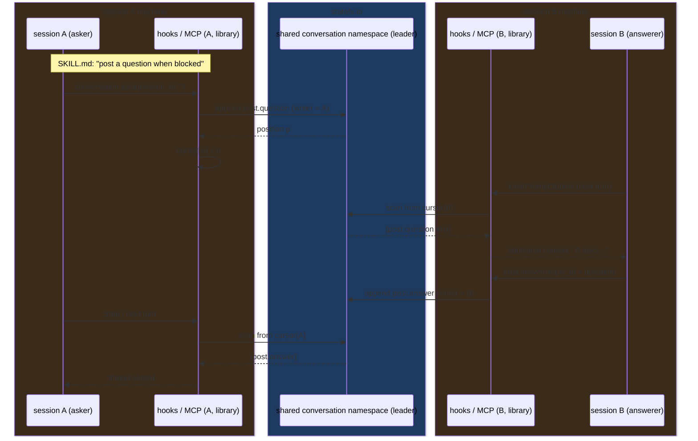
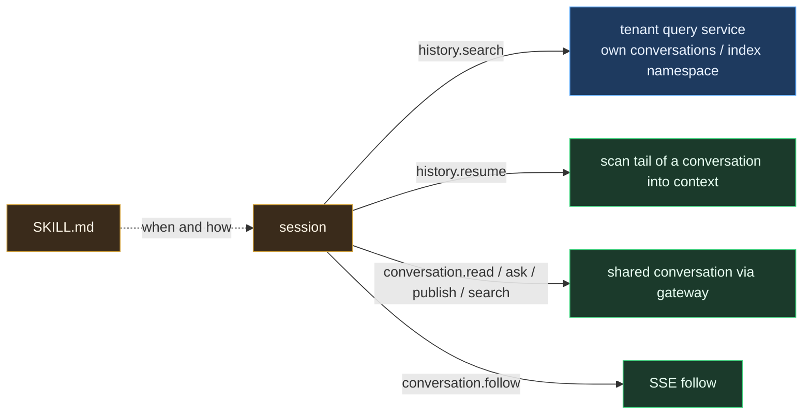
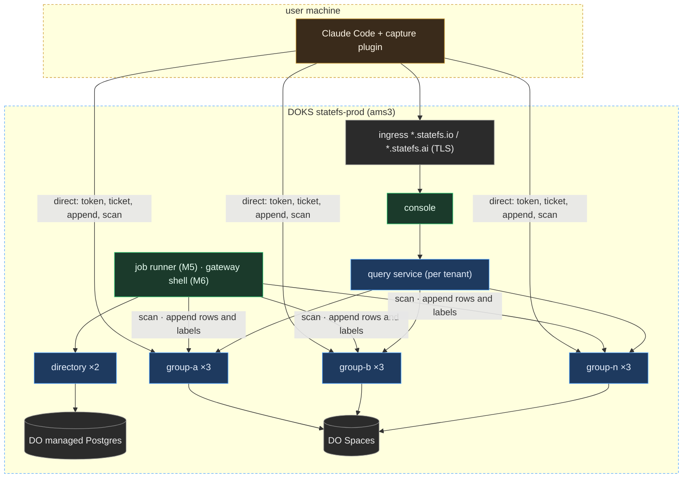

# statefs.ai, conceptual architecture (pre-finalization)

Status: conceptual, 2026-09-05; v1 decisions closed 2026-09-06 (RFC-0001 §11). Diagrams track [RFC-0001](rfcs/RFC-0001-conversation-log-platform.md);
when the open questions in RFC-0001 §11 close, this file becomes `ARCHITECTURE.md` (as-built) and stops changing shape.
Engine facts come from [STATEFS-CAPABILITIES.md](STATEFS-CAPABILITIES.md).

Vocabulary: **channel** = one statefs namespace. A **conversation** is a
single-writer channel with no tracked readers. A **shared conversation** is a
multi-writer channel whose readers each keep a cursor. An **event** is one
row: a completed block, never a token delta.

Color convention in every diagram: **amber** = client machines (plugins, people),
**green** = statefs.ai (the product), **blue** = statefs.io (engine and cluster),
**grey** = external stores. A box's color says who owns and deploys it.

## C1. System context

Three layers, top to bottom: where events are produced, the product, and
the engine. Control traffic (resolve, auth) is dashed; data traffic is solid.
Library-first (RFC-0001 #9): every green box embeds the same statefs.ai
library; no product process sits between a client and its channel.



Reading the edges: a client resolves a channel once through the directory,
then appends and scans against members directly (statefs locked decision:
the directory is never a data hop). "Subscribe" is a scan from a client-held
cursor, polled today, switched to the feed consumer mode when it lands. The
job runner is the first statefs.ai process and it only reads rows and
writes rows and labels back. The gateway shell exists only for triggers the
library cannot serve: an API proxy source, push to laptops, quotas.

## C2. Containers



The plugin keeps no channel data: the spool is a delivery buffer, the
cursor files are read positions. The library is the only place that knows
statefs.io; the plugin, the console, the job runner and a future shell all
call it the same way.

## C3. Library components and ports (hexagonal)



Outbound ports are colored by who answers them: blue ports are served by statefs.io, grey by an external store, green by product-owned state. Inbound ports are the library's Go API today; the same three become HTTP (S13, S14) when the gateway shell exists.

Adapters per port, v1: `ConversationStore` = statefs Go client + feed
gRPC; `CursorStore` = statefs namespace per tenant; `Authorizer` = statefs
API key introspection with the `tenant` claim; `Credential` = the caller's
acting token forwarded to mint 5 m grant tickets per namespace and verb,
requests signed with the HKDF MAC (RFC-0011 v2 as built, v0.5.x); `BlobStore` = S3;
`Query` = the tenant query service. Each is swappable without touching the
core. Identity is never product-owned: tenants, users, keys and grants are
RFC-0011's, and the console reuses its tenant admin API.

## Conversation shapes



## Flow 1. Capture a conversation (story 1)



Positions are assigned by statefs; the client `seq` and `event_id` make
retries safe until the batch-id seam lands upstream.

## Flow 2. Shared conversations publish and consume (story 2)



Consume happens at turn boundaries through hooks, so no agent polls between
turns. Membership is a grant on the shared conversation namespace; a session without one is
refused by the member.

## Flow 3. Follow live

```mermaid
sequenceDiagram
    box rgb(58,43,27) client
    participant C as console / MCP (library Subscribe)
    end
    box rgb(30,58,95) statefs.io
    participant M as member read
    participant F as feed (gRPC :9001, in-cluster)
    end

    C->>M: scan [cursor, head)
    M-->>C: rows
    loop today: poll every 1 s
        C->>M: scan from new cursor
        M-->>C: rows or empty
    end
    Note over C,F: later: Subscribe rides the feed consumer mode<br/>in-cluster directly; laptops through the gateway shell (M6)
```

## Flow 4. Session capabilities (story 3)



## Deployment view (v1 target)



The product console is a third app beside statefs's operator console and tenant console (RFC-0011 §6a); it signs in with user credentials only and defers identity management to the tenant console.

In v1 the only statefs.ai deployables are the console and, from M5, the
job runner; the gateway shell is drawn for M6.

## Things this shape deliberately does not do

- No token deltas as rows; blocks only.
- No data through the directory; resolve once, direct after.
- No channel data in the gateway; cursors are its only state.
- No relaxation of the one-namespace query wall; cross-channel questions go through the index channel.
- No embedding of the engine in v1; the port keeps that a later adapter.
- No product process between a client and its channel; the shell is for triggers the library cannot serve.
- No model calls in statefs.io; enrichment is a job that writes rows back.
