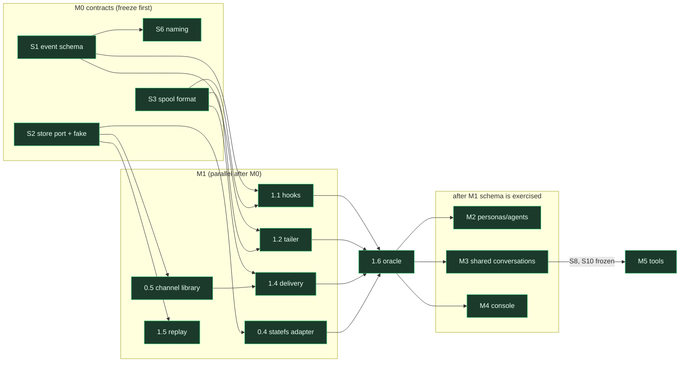

# statefs.ai, product description and implementation plan

Status: 2026-09-06. **Library-first (user decision 2026-09-06, RFC-0001 #9)**:
the plugin embeds the statefs.ai library and talks to statefs.io directly;
all content lives in the **`dev.statefs.ai`** tenant during development. A
statefs.ai server appears first as a job runner at M5; a gateway shell only
on an ingest trigger (M6). The simplification defaults stand (directory as
catalog, channel = grants, statefs authz, client-owned cursors, polling follow,
thinking visible as the conversation is, persona and agent as namespaces).
Boundary rule: statefs.io stores and indexes what is deterministic from
rows; statefs.ai computes anything model-dependent and writes it back as
rows ([FEATURES.md](FEATURES.md)).
Companions: [RFC-0001](rfcs/RFC-0001-conversation-log-platform.md) (storage
mapping, decisions), [CONCEPTUAL.md](CONCEPTUAL.md) (architecture),
[CONCEPTUAL-PRODUCT-REQUIREMENT.md](CONCEPTUAL-PRODUCT-REQUIREMENT.md)
(actors, requirements), [handoffs/](handoffs/) (asks of statefs core).

## 1. Product description

statefs.ai records what AI agents do and lets people and agents use that
record. Every agent conversation (user messages, assistant text, thinking,
tool calls and results) becomes a durable, replayable, queryable log the
moment it happens. Agents that work together post questions, reports and
artifacts to shared shared conversations and read them back on their own schedule.
A session can search and resume its own history and consult its channels.
Personas define what an agent is; agents are running instances of a
persona on a task; every one of them leaves a log.

What it is: a library, a capture plugin for agent clients (Claude Code
first) that embeds it, a console, a set of conventions over statefs.io
namespaces, and later a job runner for model-dependent enrichment.
What it is not: a chat client, a model gateway, an identity system, or a
second database. Storage, replication, identity, query and tiering are
statefs.io's; no statefs.ai process sits between a client and its channel.

Fixed principles:

| Principle | Consequence |
|---|---|
| Everything is a namespace | conversation, persona, agent are the three kinds of statefs namespace; every content stream is a conversation, with one participant (an agent's log) or many (a shared stream), access scoped by identity through grants; the directory is the catalog |
| One event per completed block | never token deltas; one row per thinking, text, tool_use, tool_result, or lifecycle event |
| Identity is statefs.io's | RFC-0011 v2: acting tokens, grant tickets, membership grants, capabilities; the product stores no credential |
| Durability by replication | members at `WALSync=interval`, RF 3; sync ack only on session end |
| Client-owned read positions | a session or console keeps its own cursor per subscription; the subscription list itself is rows in the agent's namespace |
| Library-first, shell optional | the library holds the store port, naming, schema, spool and the statefs adapter; every process (plugin, console, job runner, a future gateway) embeds it; a client subscribes to its channel namespace directly |

## 2. Data conventions (what every phase builds on)

Namespace kinds, by scope tags (`scope` is the directory's searchable
JSONB; `tags` is its reserved array):

| Kind | `scope` | `display_name` | Owner (membership) | Rows |
|---|---|---|---|---|
| conversation | `{kind:conversation, session?, agent?, persona?, task?, tags[]}` | `<agent-name>/<name>#<n>` for an agent's log; the given name for a shared one (unique per tenant) | the creating identity's membership; participants = grants | events (§2.1); shared ones also carry posts (§2.2) |
| persona | `{kind:persona, name}` | persona name | tenant admin or creator | versions: `persona.version` rows with the full definition |
| agent | `{kind:agent, persona, runtime, host}` | `<persona>#<n>` | the identity it runs as | lifecycle: `agent.started`, `assignment.opened{task}`, `assignment.closed`, `agent.stopped` |

### 2.1 Conversation event

| Field | Type | Note |
|---|---|---|
| `event_id` | ULID | client-assigned, dedupe key |
| `seq` | int64 | client-monotonic per session |
| `ts_ms`, `ingested_ms` | int64 | epoch ms (indexable later) |
| `session_id` | string | Claude Code `session_id` |
| `source` | enum | `claude-code`, `agent-sdk`, `codex`, `api-proxy` |
| `kind` | enum | `session.start`, `user.message`, `assistant.text`, `assistant.thinking`, `tool.use`, `tool.result`, `subagent.start`, `subagent.stop`, `meta.purpose`, `meta.summary`, `session.end` |
| `role` | enum | `user`, `assistant`, `system`, `tool` |
| `tool_name` | string | top-level for indexing |
| `parent_event_id` | ULID | `tool.result` to `tool.use`; subagent to parent |
| `agent_id`, `agent_type` | string | subagent attribution |
| `model`, `tokens_in`, `tokens_out` | | cost |
| `content` | JSON | kind-specific body; inline cap 256 KiB |
| `blob_ref` | string | pointer when the body exceeds the cap |

### 2.2 Posts in a shared conversation

Same envelope; `author` (identity) is set on every event in every
conversation. Posts use `kind` in `post.question`, `post.answer`,
`post.comment`, `post.report`, `post.artifact`, `post.status` and may carry
`to` (identity or `*`), `thread` (root event id), `reply_to`, `tags`. An
agent's own log and a shared stream differ only in how many identities
hold a write grant.

## 3. Milestones

| Milestone | Outcome | Depends on statefs.io |
|---|---|---|
| M0 Foundation | repo, module, schema, store port, statefs adapter, dev tenant | v0.5.4 as deployed; **DONE 2026-09-06** (enrolled `kas-agent-2` in `dev.statefs.ai`; store conformance PASS against production) |
| M1 Capture and replay | one Claude Code session captured end to end, replay equals transcript | as deployed; **oracle PASS 2026-09-06 offline AND against statefs.io** (`kas-agent-2/statefs.ai#1` in `dev.statefs.ai`, 8 rows, 0 missing / 0 duplicated, session.end last) |
| M2 Personas and agents | conversations attributed to agents and personas; fleet enrollment | as deployed |
| M3 Shared conversations | agents post and read shared streams from hooks and tools; describe, discover, subscribe with a cap and a mode | as deployed; **first cut BUILT 2026-09-06 (v0.1.6)**: create/list/join/leave/post/read/grant, injection at UserPromptSubmit with budget and digest, conversations skill, oracle on the file store |
| M4 Console | replay with thinking, agents and personas, shared conversation view, search | as deployed (static query URL) |
| M5 Session capabilities and enrichment | history and conversation tools; the job runner (summaries, embeddings, labels, graph) | core handoff: P15 indexes, positional fetch; vector index type (future ask) |
| M6 Scale | gateway shell (on trigger), push follow, more sources, million-conversation posture | core handoff: consumer feed, idle unload, batch id |

Each phase ends with a named oracle test that stays in CI.

### M0 Foundation

| Phase | Features | Specifics |
|---|---|---|
| 0.1 Repo | `git init`, module `github.com/quantumwake/statefs.ai`, layout | `cmd/statefs-ai` (plugin binary: `hook`, `tail`, `push`, `replay`, `persona`, `agent`, `channel`, `mcp`), `pkg/event`, `pkg/store` (port, fake, statefs adapter), `pkg/naming`, `pkg/spool`, `pkg/capture`, `pkg/channel` (open, append with coalescing, scan, subscribe-by-cursor), `pkg/api` (S13/S14 wire types, reserved for the shell), `plugin/` (Claude Code plugin manifest, `hooks.json`, `SKILL.md`), `console/`; `cmd/jobs` at M5, `cmd/gateway` at M6 |
| 0.2 Schema | `pkg/event` types, validation, ULID | §2.1 and §2.2 as Go structs with JSON tags; `Validate()` enforces enum, cap, parent rules |
| 0.3 Store port | `ConversationStore` interface + fake | `Open(scope, displayName)`, `Append(ns, []Event, sync)`, `Scan(ns, from, to)`, `Head(ns)`, `Find(scope)`; fake is an in-memory map used by every test |
| 0.4 statefs adapter (in the library) | `pkg/store/statefs` on the Go client | credential ladder (`STATEFS_API_KEY`, `STATEFS_KEY_FILE`, `~/.statefs/identity`), acting token exchange, per-verb tickets by the SDK, `CreateNamespace(display_name, scope)`, `Appender`, `Scan`; oracle: round-trip 1,000 events against a dev tenant, exact ints |
| 0.5 Channel library | `pkg/channel` | `Open`, `Append` with per-channel coalescing (250 ms or 64 KiB) and `event_id` dedupe within a session, `Scan`, `Subscribe(from)` (poll at 1 s now; feed consumer mode later behind the same call), all over the store port |
| 0.7 Enrollment spike (DONE 2026-09-06) | `pkg/enroll`, `pkg/plugin`, `cmd/statefs-ai` (`enroll`, `whoami`, `hook`, `fakedir`), `plugin/` skeleton | proven headless against a fake directory: SessionStart auto-enrolls from `STATEFS_ENROLL_URL` (local keygen, `/auth/enroll`, `/auth/token`), context injected and quoted by the model, all eight hook events fire; see [spikes/SPIKE-2026-09-06-claude-code-enrollment.md](spikes/SPIKE-2026-09-06-claude-code-enrollment.md) |
| 0.6 Dev tenant `dev.statefs.ai` (DONE 2026-09-06) | tenant on statefs.io; service identity `kas-agent-2` enrolled from an admin-minted URL; identity file `~/.statefs/identity` (read, write caps; the SDK default) | all development content lands in this tenant's namespaces; the store conformance test runs against it with `STATEFS_DIRECTORY` + `STATEFS_KEY_FILE` |

### M1 Capture and replay (story 1)

| Phase | Features | Specifics |
|---|---|---|
| 1.1 Hook runner | `statefs-ai hook` invoked by Claude Code hooks (wiring proven in 0.7; no matchers, Claude Code owns `CLAUDE_PLUGIN_DATA`) | reads the hook JSON on stdin; maps `SessionStart`, `UserPromptSubmit`, `PreToolUse`, `PostToolUse`, `PostToolUseFailure`, `SubagentStart`, `SubagentStop`, `Stop`, `SessionEnd` to events; `tool_use_id` becomes `event_id` of `tool.use` so `tool.result` can parent it; exits 0 in under 50 ms, never blocks the agent |
| 1.2 Transcript tailer | `statefs-ai tail <transcript_path>` started by `SessionStart`, stopped by `SessionEnd` | follows the JSONL; emits `assistant.thinking` and `assistant.text` per block keyed by message `uuid` + block index; ignores `tool_use` and `tool_result` (hooks own them) except when a hook event is missing after 5 s; handles file rotation and lag |
| 1.3 Spool | append-only local file per session | `~/.statefs-ai/spool/<session>.jsonl`; every event written before any network; ack offsets recorded; survives crashes; redaction hook point (`REDACT` regex list) applied before write; thinking dropped when the credential is a service identity |
| 1.4 Delivery | `statefs-ai push` through `pkg/channel` straight to statefs.io | reads the spool from the ack offset; opens the conversation namespace on first event (scope §2, `display_name` from cwd and first prompt, owner = the credential's membership); credential ladder and per-verb tickets by the SDK; batches by 100 events or 250 ms; `session.end` with sync durability; retries with backoff; at-least-once; advances the ack on success |
| 1.5 Replay | `statefs-ai replay <conversation>` | scans through the store port, paged by position; prints events or JSON; `--diff <transcript>` compares block content by uuid |
| 1.6 Oracle (offline PASS 2026-09-06) | `scripts/oracle-m1.sh` (real headless session, file store) + `TestSpoolToStoreRoundTrip` (unit) | drive a real `claude -p` session with the plugin installed against `dev.statefs.ai`; replay; every transcript block present exactly once, order by `seq`, no duplicates after a forced retry |

M1 load test (2026-09-06, `scripts/loadtest.py --agents 10 --minutes 3`): ten concurrent haiku sessions, one task every 6 s, all captured through the installed plugin into ten conversations on statefs.io, 1,196 rows in 184 s wall, zero agent errors, `session.end` last on every one. Only defect: the local name cache lost two entries to a cross-process write race; replaced by one file per conversation.

M1 is installable (2026-09-06): the repo is its own marketplace (`/plugin marketplace add quantumwake/statefs.ai`, `/plugin install statefs-ai@statefs-ai`); the hook wrapper `scripts/statefs-ai` (sh, plus a PowerShell twin) builds from vendored source or downloads the release asset; six release binaries (darwin, linux, windows x amd64, arm64) on tag `v0.1.0`; a session through the installed plugin captured into statefs.io with no `--plugin-dir`.

M1 as built (2026-09-06): hooks write the spool (`pkg/capture.FromHook`), a detached `statefs-ai daemon` per session tails the transcript (`Tailer`, ids derived from line uuid + block index) and pushes (`Pusher`: seq by delivery order, redaction, `session.end` deferred until the transcript is quiet so it lands last), `statefs-ai replay --diff` is the oracle in command form, `store.File` gives an offline store. Real run: 8 rows, session.end last, 0 missing / 0 duplicated, daemon exits after delivery.

### M2 Personas and agents (catalog)

| Phase | Features | Specifics |
|---|---|---|
| 2.1 Persona | `statefs-ai persona create|version|show` | persona namespace; each version row holds `{name, purpose, instructions, skills[], model_prefs}`; agents pin `persona_version` |
| 2.2 Agent | `statefs-ai agent start|assign|stop` and automatic per-session agents | local Claude Code creates a per-session agent under the person's identity at `SessionStart` (scope `{kind:agent, persona, runtime:claude-code, host}`); rows for lifecycle; conversation scope carries `agent` and `persona` |
| 2.3 Fleet enrollment | autonomous agents as service identities | `statefs keygen` + RFC-0011 enrollment token at first boot; `~/.statefs/identity` thereafter; documented runbook |
| 2.4 Listing | `statefs-ai ls agents|personas|conversations --where k=v` | directory scope search and `?q=`; latest state = tail row of the namespace |
| 2.5 Oracle | `TestAgentAttribution` | two agents of one persona, two conversations each; every conversation resolves to the right agent and persona version by scope alone |

### M3 Shared conversations (story 2)

| Phase | Features | Specifics |
|---|---|---|
| 3.1 Stream (BUILT v0.1.6) | `statefs-ai conversation create|join|leave|grant` | shared conversation namespace (`mode: shared`, name, description, tags); join = prove a read ticket works, then a local subscription file; grant = `POST /tenant/grants` (tenant admin only today, handoff delta 8); leave = drop the subscription |
| 3.2 Publish | `statefs-ai conversation post` and MCP `conversation.publish` | message per §2.2; `author` from the acting token identity; threads by `reply_to` |
| 3.3 Read | `statefs-ai conversation read --since` and MCP `conversation.read` | client cursor in `~/.statefs-ai/cursors/<conversation>`; `Subscribe(from cursor)`; filters `to`, `thread`, `kind` applied in the library |
| 3.4 Hooks inject | `UserPromptSubmit` and `SessionStart` hooks | fetch new messages since cursor, return them as hook additional context, advance cursor; bounded to 20 messages and 8 KiB per turn |
| 3.5 Skill (DROPPED 2026-09-06, user: the agent can work it out) | none | the SessionStart context names the binary and verbs; `--help` carries the rest; conventions such as answering with `--reply-to` live in the injected post text |
| 3.6 Oracle (exchange) | `TestTeamExchange` | two sessions: A asks, B sees it at its next turn, answers, A sees the answer; cursors advance; a third session with no grant is refused by statefs |

| 3.7 Descriptions | every shared conversation carries a description | `display_name` (the searchable name), `scope.description` (one line), `scope.tags[]` (topics), and a `meta.purpose` row whose history is the description over time; `statefs-ai conversation create --name --description --tags`; `describe` rewrites scope and appends `meta.purpose` |
| 3.8 Discovery | `statefs-ai conversation search` and MCP `conversation.search` | directory `?q=` on name and scope containment on tags and kind, issued with the caller's acting token; on statefs.io the directory scopes by tenant only, so every member lists every conversation and the `access` column (a head-read probe) says whether this identity may read it; delta 6 applies only to user-scoped deployments; result rows show name, description, tags, head, and whether the caller already subscribes |
| 3.9 Subscriptions | `statefs-ai conversation subscribe|unsubscribe|subscriptions` and MCP `conversation.subscribe` | the subscription list is durable in the **agent's own namespace** as `agent.subscribed{conversation, mode}` / `agent.unsubscribed` rows (replayable, per agent, survives reinstalls); the plugin caches it locally with one cursor file per subscription; cap `max_subscriptions` (default 20, per agent, enforced in the library, refused with a clear error); subscribing requires a read grant, else refused by the directory |
| 3.10 Modes | `mode: full | digest`, `digest_pick: all | first | <persona>` per subscription | `full` injects every new post at turn boundaries; `digest` injects only `post.report`, `post.status` and `meta.summary` rows (author-declared and, from M5, job-written summaries); per-turn budget across all subscriptions: 20 messages and 8 KiB, ordered `to = me` first, then threads the agent participates in, then the rest, remainder deferred to the next turn |
| 3.12 Summaries by participants | `post.request`, `post.claim`, `meta.summary` with `indexable` | local rule: at a reader's turn, if unsummarized rows since the last summary exceed N (default 200) and no open request exists, the library posts a request for that range; any participant may answer; a `post.claim` reply is advisory (signal, not lock), so several agents may summarize the same range and each result is kept as a perspective attributed to `author` and persona; each summary posts with `reply_to`, `summary_of`, `indexable: true`; digest mode injects summaries, not sections, choosing by the subscription's `digest_pick` (`all` default, `first`, or a persona); no server involved |
| 3.13 Oracle (summaries) | `TestParticipantSummary` | two agents of different personas on one conversation with 250 rows; A's turn posts a request; both summarize; two `meta.summary` rows exist for the same range with different authors; a digest-mode reader C with `digest_pick: all` receives both, with `first` receives one; a second request covers only rows after the summaries |
| 3.11 Oracle (discovery) | `TestDiscoverSubscribeDigest` | agent A creates a described conversation with tags; agent B with a grant finds it by tag, subscribes in digest mode, sees only reports at its next turn, switches to full, sees everything; a 21st subscription is refused; an identity without a grant cannot find it |

### M4 Console (story 1, 2 surface)

| Phase | Features | Specifics |
|---|---|---|
| 4.1 Auth | sign in with a user credential | `POST /auth/token` exchange in the browser; tenant switcher when multi-membership; identity management links to the statefs tenant console |
| 4.2 Conversations | list, search, replay | directory scope search and `?q=` from the browser (as the statefs tenant console does); replay viewer renders blocks in order, thinking collapsible, tool call and result paired by `parent_event_id`; polls the member read at 1 s for open conversations |
| 4.3 Agents and personas | tables and detail pages | latest state from namespace tails; persona version history; agent assignment history |
| 4.4 Channel view | stream reader and composer | browser-held cursor; thread view; post as the signed-in identity |
| 4.5 SQL | per-conversation query | resolves the tenant query service (static URL pattern until query members register) and runs `json_extract` examples; `as_of` shown |
| 4.6 Library first | components from `@quantumwake/terminal-ux-components` and dashboard components | missing pieces go into the library, never hand-rolled here |

### M5 Session capabilities (story 3), after the core handoff lands

| Phase | Features | Specifics |
|---|---|---|
| 5.1 MCP server | `statefs-ai mcp` over stdio | tools `history.resume`, `history.search`, `conversation.read`, `conversation.publish` over the library; registered by the plugin |
| 5.2 Resume | `history.resume(conversation, last_n)` | scans the tail into context at `SessionStart`; honors `min_head` (P14 S2) so the last append is visible |
| 5.3 Search | `history.search(query, since, kind, tool)` | directory scope search across the identity's conversations, then per-conversation index reads (P15 hash on `tool_name`, bitmap on `kind`, zonemap on `ts_ms`) and positional row fetch; falls back to per-conversation SQL until indexes exist |
| 5.4 Job runner | `cmd/jobs` under a per-tenant service identity | the first statefs.ai server, and it calls no model: it posts `post.request` rows for tenant-level policies (summarize idle conversations, embed new rows, label topics) that participants or dedicated worker agents fulfil; embeddings, labels and graph triples are written back as rows or scope labels by those agents; the job is scheduled and idempotent by range |
| 5.5 Oracle | `TestSearchUsesIndexes` | the same query answered with and without indexes returns identical rows; latency recorded |

### M6 Scale, when a listed trigger appears

| Phase | Features | Specifics |
|---|---|---|
| 6.1 Gateway shell | `cmd/gateway` over the library, S13/S14 | triggers: the API proxy source, push delivery to laptops (the member feed port is in-cluster only), or per-tenant quotas; Helm on statefs-prod, `gateway.statefs.ai` |
| 6.2 Push follow | feed consumer mode | `Subscribe` switches from polling to the feed for in-cluster callers; laptops get push through the shell |
| 6.3 More sources | Agent SDK wrapper, Codex tailer, API proxy (the proxy runs inside the gateway) | same event schema; each with a round-trip oracle |
| 6.4 Million conversations | idle unload, batch-id append, byte compaction | remove the interim workarounds (soft cap, read-side dedupe, polling); run the statefs loadgen shape at 1M namespaces over 3 groups |

## 4. Seams and contracts (what makes phases parallel)

A phase may start as soon as the contracts on its seams are frozen. A
contract is frozen when its definition is in the repo with a golden fixture
and a conformance test that both the provider and every consumer run. Until
the real provider exists, consumers build against the fixture or fake.

| # | Seam | Contract | Provider | Consumers | Fixture / fake |
|---|---|---|---|---|---|
| S1 | Event schema | `pkg/event`: Go structs, JSON encoding, `Validate()` (§2.1, §2.2) | 0.2 | every phase | `testdata/events/*.json` golden files, one per `kind` |
| S2 | Store port | `ConversationStore` interface (below); lives in the library, embedded everywhere | 0.3 interface + fake; 0.4 real | 0.5, 1.4, 1.5, 2.x, 3.x, 5.x, 6.1 | `store.Fake` (in-memory, deterministic positions) |
| S3 | Spool format | JSONL, one event per line, `<session>.jsonl` + `<session>.ack` (byte offset of last delivered line), append-only, fsync on `session.end` | 1.3 | 1.1, 1.2 (writers), 1.4 (reader), 3.3 | `testdata/spool/session-*.jsonl` |
| S4 | Claude Code hook I/O | external: stdin JSON (`session_id`, `transcript_path`, `cwd`, `hook_event_name`, `tool_name`, `tool_input`, `tool_use_id`, `tool_output`), stdout JSON for additional context, exit codes | Claude Code (pinned to the docs at 2026-09-04) | 1.1, 3.4 | `testdata/hooks/*.json`, one per event |
| S5 | Transcript JSONL | external: lines with `type`, `uuid`, `parentUuid`, `message.content[]` blocks (`thinking`, `text`, `tool_use`, `tool_result`), `timestamp`, `sessionId`, `cwd`, `gitBranch` | Claude Code | 1.2, 1.5 | `testdata/transcripts/sample.jsonl` (a real 200-line session, secrets scrubbed) |
| S6 | Namespace conventions | `pkg/naming`: `ConversationScope(...)`, `AgentScope(...)`, `PersonaScope(...)`, `TeamScope(...)`, `DisplayName(kind, parts...)`, `Find` filters (§2 table) | 0.2 | 1.4, 2.x, 3.1, 4.x | table-driven tests; the fake store enforces `display_name` uniqueness per tenant |
| S7 | Catalog rows | persona `persona.version{definition}`, agent `agent.started/assignment.opened/assignment.closed/agent.stopped`, `meta.purpose` in conversations | 2.1, 2.2 | 2.4, 4.3, 5.3 | golden rows in `testdata/catalog/` |
| S8 | Cursor file | `~/.statefs-ai/cursors/<conversation>.json` = `{"namespace","position","updated_ms"}`; write is atomic rename | 3.3 | 3.4, 4.4 (browser equivalent), 5.1 | fixture + test for concurrent readers |
| S9 | CLI surface | `statefs-ai <hook|tail|push|replay|persona|agent|channel|ls|mcp>`; JSON on `--json`; exit 0 ok, 2 usage, 3 auth, 4 statefs error | 1.x, 2.x, 3.x | skill, console docs, scripts | `cli_test.go` golden outputs |
| S10 | MCP tools | JSON schemas for `history.resume`, `history.search`, `conversation.read`, `conversation.publish` inputs and outputs | 5.1 (schemas frozen in M3) | Claude Code, `SKILL.md` | `testdata/mcp/*.schema.json` + example calls |
| S11 | statefs.io APIs | external, pinned to v0.5.4: `/auth/token`, `/auth/ticket`, namespaces create/find/`?q=`, `POST/GET /api/v1/state/{ns}`, tenant plane grants, query service | statefs.io | 0.4, 4.x | the Go SDK is the contract; smoke against the dev tenant |
| S13 | Gateway ingest API (reserved for the M6 shell; frozen now so nothing is redesigned) | `POST /v1/ingest` `{channel?: id, session_id?, events: [Event]}` with `Authorization: Bearer <acting token>`; response `{channel, positions: {event_id: position}, dropped: [event_id]}`; 200 all stored, 207 partial, 401 token, 403 grant, 413 body over 8 MiB, 429 backpressure with `Retry-After` | 0.5, 1.4b | 1.4, 3.2, 5.1, 6.3 | `httptest` server over `store.Fake`; golden request/response pairs in `testdata/api/` |
| S14 | Gateway read API (reserved for the M6 shell) | `GET /v1/channels/{id}/events?from=&to=&kind=&to_ident=&thread=&limit=` paged by position, `GET /v1/channels?filter=<scope json>&q=&limit=`, `GET /v1/channels/{id}` (namespace + head) | 0.5, 1.5 | 1.5, 3.3, 4.x, 5.1 | same fixture server |
| S12 | Credential ladder | `STATEFS_API_KEY` \| `STATEFS_KEY_FILE` \| `~/.statefs/identity`, acting token cache, per-verb tickets | SDK (external) | 0.4, 2.3, 4.1 | SDK behavior; product never re-implements |

The store port, frozen in 0.3:

```go
package store

type Scope map[string]any            // directory scope JSONB; "tags" reserved
type Position int64                  // statefs row position

type Namespace struct {
    ID          string   // statefs namespace handle (UUID)
    DisplayName string
    Scope       Scope
    Head        Position // rows so far; -1 unknown
}

type ConversationStore interface {
    // Open creates or returns the namespace for scope+displayName.
    // Idempotent on (tenant, displayName).
    Open(ctx context.Context, displayName string, scope Scope) (Namespace, error)
    // Append writes events at the tail in order. sync=true requests replica-
    // confirmed durability. Returns the position of the first event.
    // At-least-once: callers keep event_id; duplicates are possible on retry.
    Append(ctx context.Context, ns string, events []event.Event, sync bool) (Position, error)
    // Scan yields events in [from, to) in position order; to<=0 means head at call time.
    Scan(ctx context.Context, ns string, from, to Position) iter.Seq2[event.Event, error]
    Head(ctx context.Context, ns string) (Position, error)
    // Find returns namespaces whose scope contains the filter (directory containment search).
    Find(ctx context.Context, filter Scope, limit int) ([]Namespace, error)
}
```

Semantics both implementations must pass (`store.ConformanceTest`):
positions are contiguous and start at 0; `Scan` after `Append` sees the
rows (read-your-writes on the primary); `Open` twice with the same
`displayName` returns the same ID; `Find` is containment, not equality;
errors are typed (`ErrRefused`, `ErrNotFound`, `ErrDurabilityNotConfirmed`).

### 4.1 Parallel plan



Rules: M0 is short and sequential because it is nothing but contracts. In
M1, hooks and tailer write only to the spool, delivery reads the spool and
calls the channel library, the channel library and the adapter each
implement one port, so four people (or agents) can work at once and meet
at the 1.6 oracle. M2, M3 and
M4 touch different namespace kinds and different CLI subcommands; they
share S1 and S6 only. M4 can start on a recorded conversation from the
fixture store before M1 is green. A contract change after freeze is a
versioned change: bump the fixture, run every consumer's conformance test.

## 5. Order and gates

M0 freezes contracts and gates everything. Inside M1 the phases run in
parallel on the frozen seams (§4.1). M2, M3 and M4 are independent after
the 1.6 oracle. M5 waits on the
core handoff (P15 S1 to S3, positional fetch). M6 starts when a listed
trigger appears, not by date.

Gate per milestone: the oracle tests green in CI, a five-minute demo on the
dev tenant, and RFC-0001, CONCEPTUAL.md and this plan updated to as-built.

## 6. Open items this plan carries

| Item | Owner | Default if unanswered |
|---|---|---|
| Remaining simplification defaults (thinking visibility, persona and agent as namespaces) | user | as assumed above; the gateway question is closed (library-first, shell on trigger) |
| `display_name` uniqueness per tenant versus per owner | statefs core | derive unique names client-side |
| Batch ticket mint | statefs core | SDK mints per namespace, cached 5 m |
| Query members registering with the directory | statefs core (deferred) | static URL pattern in the console |
| Google sign-in, self-serve tenancy, public tenant (statefs `docs/handoffs/HANDOFF-2026-09-06-statefs-ai-identity-requests.md`) | deferred (user, 2026-09-06) | **decided: each logged-on user of a host machine enrolls once with an admin-minted token; the agents that user runs share that identity**; revisit when external users need self-serve |
