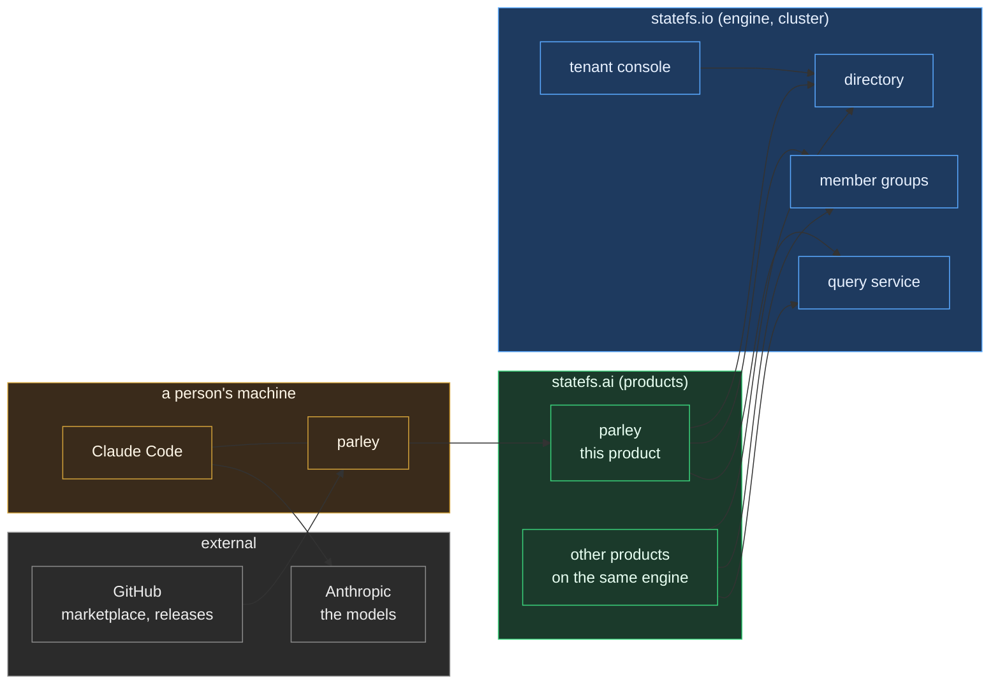
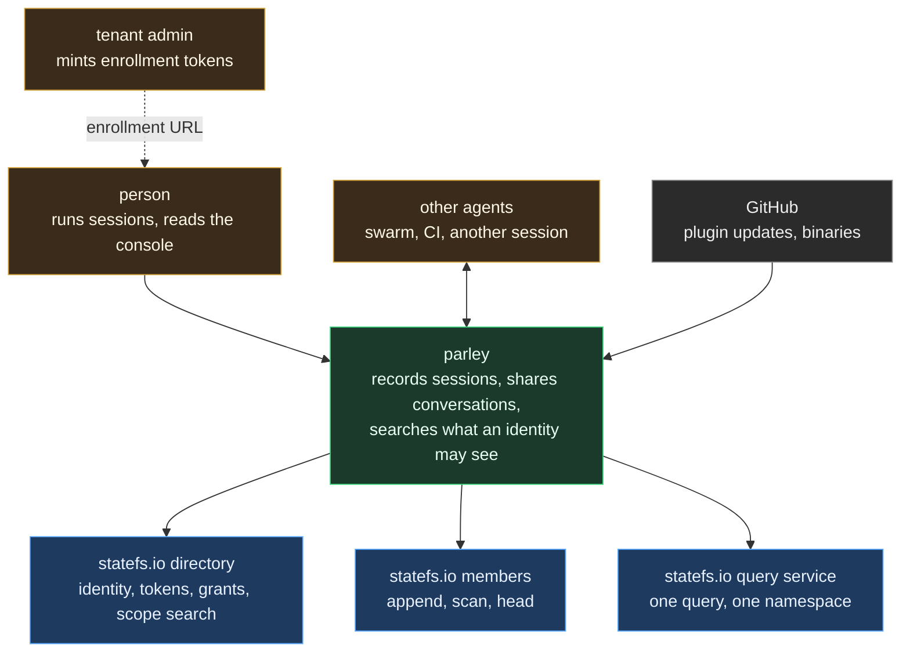
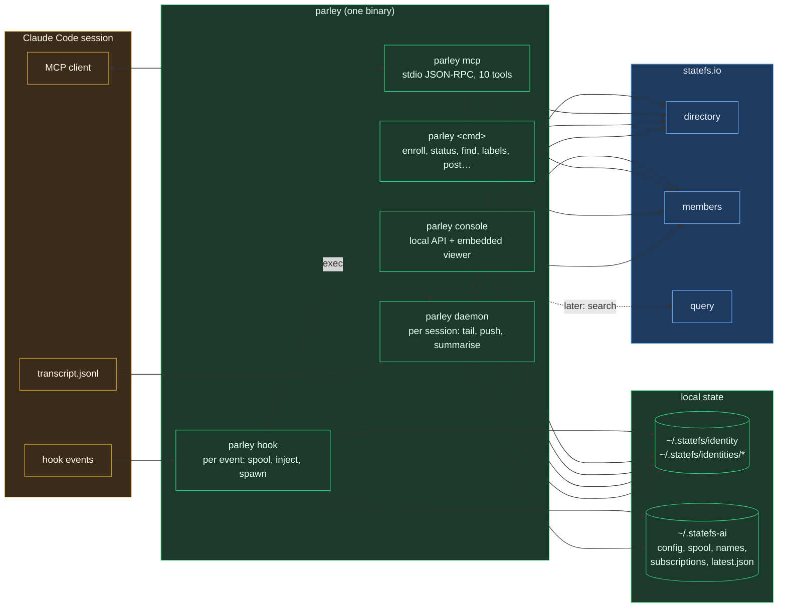
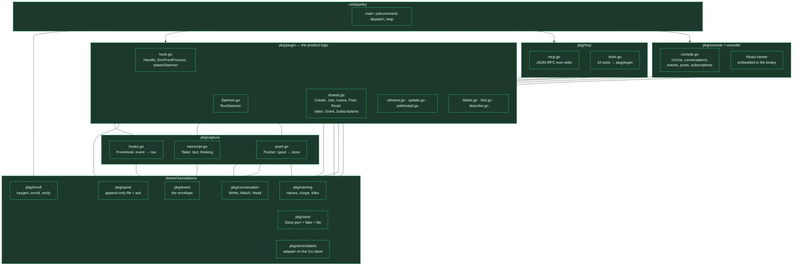
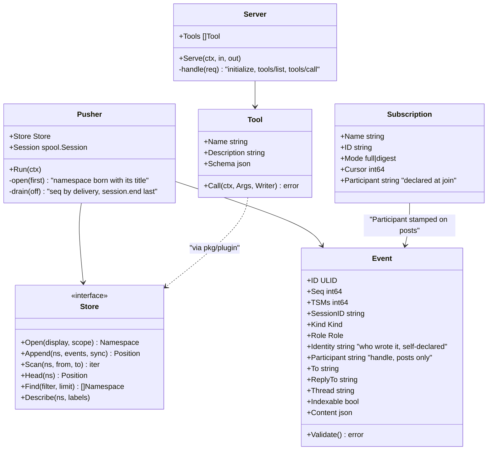

# Layout: parley from C0 to C4

Status: 2026-09-11, as built at 0.3.0. For review.

One binary, three entry points, all called parley:

| Face | Entry point | What it is |
|---|---|---|
| the plugin | `parley hook`, `parley daemon` | wraps Claude Code's hooks so every session is captured |
| the tools | `parley mcp` | an MCP server: create, join, post, read, search, grant |
| the CLI | everything else, plus `parley console` | enroll, status, the viewer, and the same operations by hand |

They share one identity resolution, one store adapter and the same
functions underneath, so they cannot drift. Colours throughout: amber is
the client side, green is statefs.ai, blue is statefs.io, grey is external.

## C0. Landscape

Where parley sits among the systems it touches.

statefs.ai is one product on the engine. The engine stores, indexes what it
stores, and enforces grants. Nothing in the engine calls a model.

## C1. System context

Who uses parley and what it depends on.

## C2. Containers

The runnable pieces. Everything green is the one `parley` binary or what it
embeds and keeps on disk.

| Container | Lifetime | Talks to |
|---|---|---|
| `parley hook` | one process per hook event, milliseconds | spool; the directory only at SessionStart and for injection |
| `parley daemon` | one per session (lock file), until its last `session.end` or idle; resumes keep it or restart it | transcript, spool, directory, members |
| `parley mcp` | one per session, started by Claude Code from `.mcp.json` | directory, members |
| CLI commands | one process each | directory, members |
| `parley console` | until closed; serves a local API and the React viewer | directory, members |
| local state | on disk | identities under `~/.statefs`, everything else under `~/.statefs-ai` |

## C3. Components

The Go packages, and how the three faces share them.

The rule this diagram enforces: **the MCP tools and the console API call
`pkg/plugin`, never the store directly.** A behaviour exists once, in
`pkg/plugin`, and every face gets it.

## C4. Code

The types that carry the design decisions.

Four decisions live in these types:

- `Event.Identity` and `Event.Participant` replace `author`. Neither is
  attested by anything; see [participants](05_participants.md).
- `Store` is a port. The statefs adapter is one implementation; the fake
  and the file store make the whole pipeline testable offline.
- `Pusher.open` is where a conversation is born with its title, because a
  read/write key cannot relabel after birth.
- `Subscription.Participant` is where a handle lives, so a post can carry it
  without the posting process knowing which session it is in.

## What is not in the picture yet

Index namespaces and synopsis rows, the daemon's summarisation cadence, and
teams are designed in the `statefs.ai` repo. None of it exists in the code
above.
