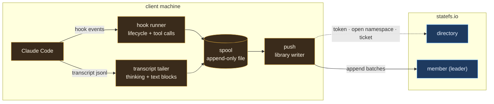
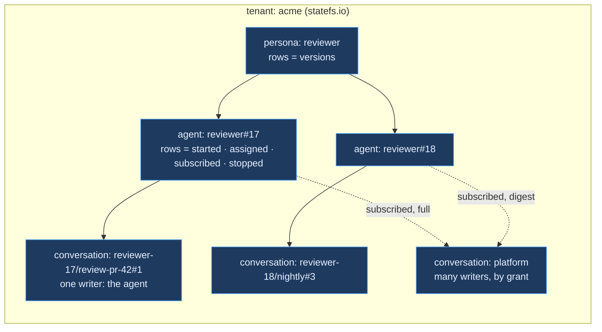
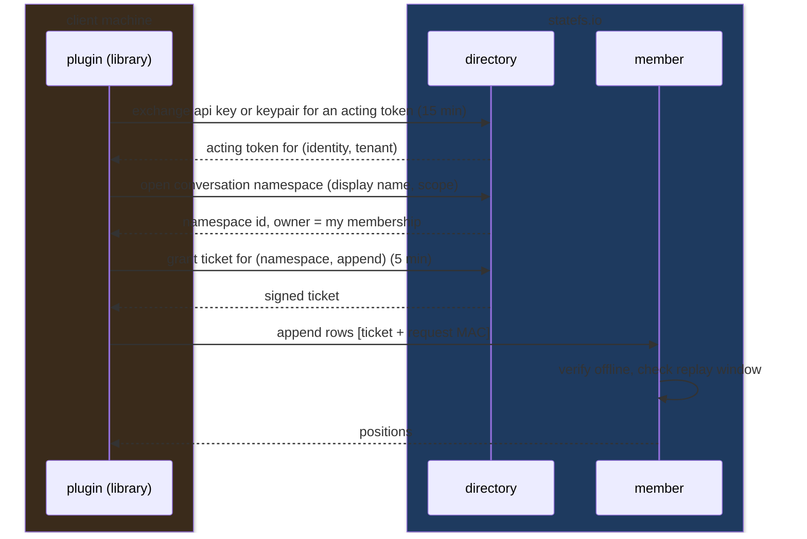
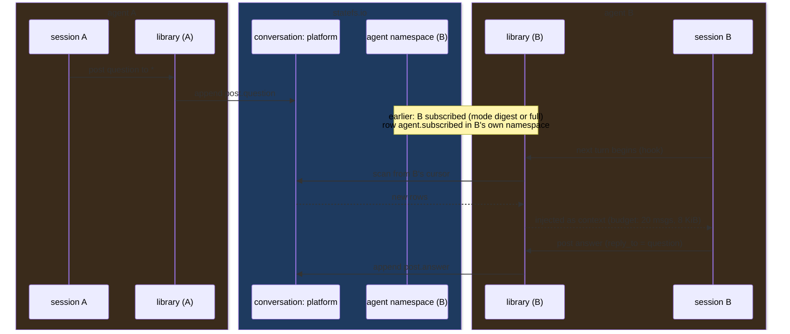
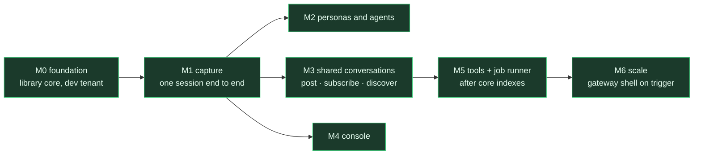

# statefs.ai in plain terms

Status: 2026-09-06. The one document to read first. The body is the short
version; the appendices add depth. Everything here is consistent with
[RFC-0001](../rfcs/RFC-0001-conversation-log-platform.md) (decisions),
[PRODUCT-PLAN.md](../product/01_plan.md) (milestones and contracts),
[CONCEPTUAL.md](03_conceptual.md) (architecture) and [FEATURES.md](../product/02_features.md).

Color convention in every diagram: **amber** = client machines,
**green** = statefs.ai, **blue** = statefs.io, **grey** = external stores.

## What we are building

A product that records what AI agents do and lets people and agents use
the record. Every Claude Code session becomes a permanent log of what was
said, thought and done. Agents can also share logs with each other.
Storage is statefs.io. We build the pieces around it.

## The pieces

1. **A plugin** installed next to Claude Code. It watches a session,
   writes each completed block to a local file, and ships those blocks to
   statefs.io as rows in that session's own namespace.
2. **A library** the plugin embeds. It knows how to log in, open a
   namespace, append, read and follow. Later the console and a job runner
   embed the same library.
3. **A console** for people: list conversations, replay them with the
   thinking visible, read shared conversations, run SQL.
4. **Later, a job runner**: a service that reads conversations, calls a
   model, and writes summaries, embeddings and labels back as rows.

## Three ideas that keep it simple

- Every conversation is one statefs namespace. An agent's own log has one
  writer. A shared conversation has many. The only difference is who holds
  a grant.
- Personas and agents are namespaces too. A persona's rows are its
  versions. An agent's rows are its lifecycle and its subscriptions.
- The product stores no data of its own and no credentials. Identity,
  grants and search come from statefs.io.

## The decisions and their trade-offs

| Decision | What we gain | What we give up |
|---|---|---|
| No gateway in v1; the plugin talks to statefs.io directly | one less service to run, no extra hop, nothing to get out of sync | no server-side logic until the job runner exists; push to laptops waits for M6 |
| Completed blocks only, never tokens | small, readable rows; exact replay | no token-by-token replay of how text appeared |
| Durability by replication, not fsync per event | a member handles hundreds of thousands of rows per second instead of about twenty thousand | a leader losing power inside one second can lose that second unless a replica already had it, which with three copies it normally does |
| Thinking stored under the person's own key only | privacy by default; capture where it matters | shared or service keys leave no reasoning trace |
| Readers keep their own cursor | statefs holds no subscriber state | a laptop that loses its files re-reads from the subscription row in its agent namespace |
| Follow by polling every second in v1 | works from anywhere today | one second of delay and light constant load until the feed consumer mode exists |
| The directory is the catalog; no product database | one storage system, no sync problems | lookups are by id, name and tags only until indexes exist |
| statefs.io stores; statefs.ai summarizes | clean boundary; statefs stays model-free | summaries and semantic search need the job runner (M5) |

## Not solved yet, and depends on statefs core

- Discovery of shared conversations someone granted you. Search today only
  shows what your own claims cover. Small directory change, recorded.
- Exactly-once on retry. A timed-out append can still land, so the plugin
  dedupes by event id until the core adds batch ids.
- A million live conversations. Idle namespaces keep files open in the
  engine. Fine at tens of thousands; a core change beyond that.
- Indexes and semantic search. Core P15 first, then our job runner.

## Where we are

The library core is written and tested against a fake store: event
schema, store port, statefs adapter, naming, and the conversation writer
and subscriber. Nothing is committed. Next: a `dev.statefs.ai` tenant with
one person identity and an API key, then one real Claude Code session
captured, stored and replayed identical to its transcript.

---

## Appendix A. How a session becomes rows

Two sources feed the spool because each knows something the other does
not. Hooks fire in real time with exact tool input and output. The
transcript holds the thinking and text blocks. The spool is written before
any network call, so a crash loses nothing. The push reads the spool from
its last acknowledged offset, so a restart resumes.

One row per completed block:

| Row kind | Comes from | Carries |
|---|---|---|
| `session.start`, `session.end` | hooks | cwd, version, branch; end is written with sync durability |
| `user.message` | hook | the prompt |
| `assistant.text`, `assistant.thinking` | transcript | the block text, model, tokens |
| `tool.use`, `tool.result` | hooks | tool name, input, output; the result points at its call |
| `subagent.start`, `subagent.stop` | hooks | agent id and type |
| `meta.purpose`, `meta.summary` | product | name and purpose changes; job-written summaries |

Every row has a client-generated id (a ULID, sortable by time) and a
per-session sequence number. statefs assigns the permanent position.
Bodies over 256 KiB go to blob storage and the row carries a pointer.

## Appendix B. Namespaces and what lives in them

| Kind | Scope labels (searchable) | Display name | Owner | Rows |
|---|---|---|---|---|
| conversation | `kind`, `session`, `agent`, `persona`, `task`, `tags` | `<agent>/<name>#<n>` for an agent's log; the given name for a shared one | the creating identity; participants hold grants | events and posts |
| persona | `kind`, `name` | persona name | tenant admin or creator | `persona.version` with the full definition |
| agent | `kind`, `persona`, `runtime`, `host` | `<persona>#<n>` | the identity it runs as | lifecycle, assignments, subscriptions |

"Latest state" of a persona or agent is its last row. History is the
whole namespace. Nothing is ever updated in place.

## Appendix C. Identity and access, end to end

statefs.io owns identity (RFC-0011 v2, shipped). The product never stores
a credential and never decides access on its own.

- **First start**: the plugin is handed an enrollment URL minted by a tenant admin (`https://directory.statefs.io/enroll?token=en_...`), generates its keypair locally, registers the public half with the single-use token, and from then on exchanges signed assertions. Proven headless on 2026-09-06 (see `spikes/`).
- **Identity**: a person or a service, with one or more authenticators
  (password, API key, registered keypair). Service agents enroll with a
  single-use token and generate their own key; no human copies secrets.
- **Membership**: an identity belongs to a tenant; grants attach to the
  membership, so rotating a key changes nothing.
- **Capabilities** on a credential narrow what it may do: `read`,
  `write`, `manage`. The plugin's key is read and write; deleting a
  conversation needs manage.
- **A shared conversation** is one whose owner granted other memberships
  `read` or `write`. That is the whole membership model.

## Appendix D. Shared conversations: publish, subscribe, discover

- **Description**: display name, `scope.description`, `scope.tags`, and a
  `meta.purpose` row per change.
- **Discovery**: search by name or tag through the directory under your
  own token. Today that returns only namespaces carrying your own claims;
  the core change to include granted namespaces is handoff delta 6.
  Interim: share the id.
- **Subscribe**: appends `agent.subscribed{conversation, mode}` to the
  agent's namespace; unsubscribe likewise. Cap 20 per agent by default.
- **Modes**: `full` injects every new post; `digest` injects only reports,
  status and summaries. Messages addressed to the agent come first.
- **Cursor**: one file per subscription on the client; the subscription
  row is the durable record if files are lost.

## Appendix E. Durability and scale, with numbers

From statefs measurements (Apple M3 Max micro-benchmarks and the kind
drills; Linux re-run pending):

| Quantity | Value |
|---|---|
| Append, fsync per row, one member | 18 to 22 thousand rows per second |
| Append, fsync at most once a second, one member | 330 to 500 thousand rows per second at 1 to 8 writers |
| Promotion after a leader dies | 2 seconds |
| Sustained through failovers on the test rig | 2,000 rows per second, zero acknowledged loss |
| Warm SQL query (P14 access layer) | about 52 ms |

The posture chosen: fsync at most once a second on each member, three
copies per group, replica-confirmed acknowledgement only for
`session.end`. The write rate is not the ceiling for this product. The
ceiling is open namespaces: every conversation touched since a member
started keeps a file handle and a memory buffer until it seals, and small
conversations never seal. That is the first core ask.

Base scenario for sizing: one million live conversations, 20 percent
emitting, 0.2 events per second each, 2 KiB per event. That is 40,000
events per second and about 7 TB a day before Parquet compression
(expect three to six times smaller on text).

## Appendix F. What we depend on from statefs core

Recorded in the handoff, ordered:

1. Idle-namespace unload and seal-on-idle (the million-conversation ceiling).
2. Batch-id idempotent append (exactly-once on retry).
3. Positional row fetch on the gated member read surface (index to rows without DuckDB), and P15 index reads on that surface.
4. Consumer mode on the replication feed (push instead of polling).
5. Byte target in compaction (tool outputs make huge blocks).
6. Directory find that includes granted namespaces (discovery).

Future: a vector index type over a stored embedding column, and
tenant-level index namespaces, both under the rule that statefs owns what
is deterministic from rows.

## Appendix G. Milestones at a glance

Each milestone ends with a named test that stays in CI, and a five-minute
demo on the dev tenant. M2, M3 and M4 run in parallel after M1.

## Appendix H. Glossary

| Term | Meaning here |
|---|---|
| conversation | one statefs namespace holding rows; an agent's log (one writer) or a shared stream (many) |
| event, row, block | one completed unit of a session: a message, a thinking block, a tool call or result, a post |
| persona | a versioned definition of what an agent is: purpose, instructions, skills, model preferences |
| agent | one running instance of a persona, with an identity, a host and a runtime |
| assignment | what an agent is working on, recorded as rows in its namespace |
| spool | the plugin's local append-only file between capture and delivery |
| cursor | a reader's position in a conversation, kept by the reader |
| subscription | an agent's durable declaration that it reads a conversation, with a mode |
| scope, tags | the searchable labels on a namespace, held by the directory |
| grant | permission for a membership to read or write a namespace |
| acting token, grant ticket | the short-lived credentials statefs.io issues for requests and for the data plane |
| job runner | the first statefs.ai server: model-dependent enrichment written back as rows |
| gateway shell | an optional service over the same library, added only for the triggers listed in the plan |
