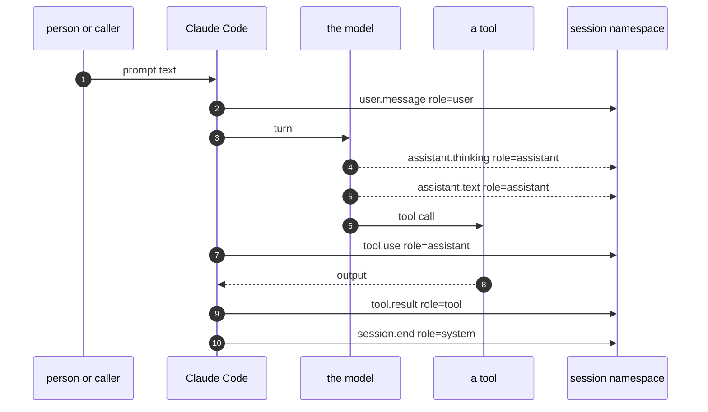
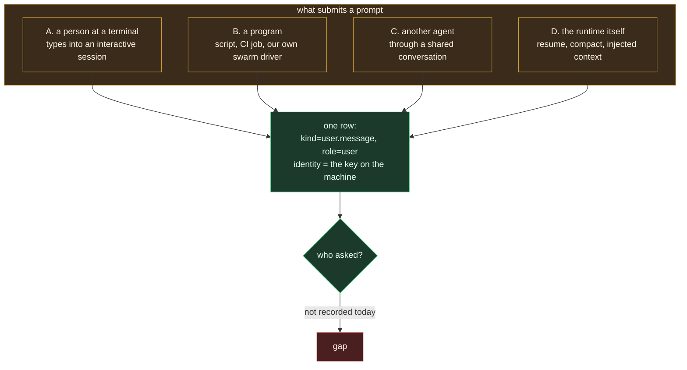

# Paths: who speaks in a session, and who asked

Status: as built, 0.3.0, with a proposal in §6.

## The problem

A row that says `role: user` means "a user-role message". It does not mean a
person typed it. A script, another agent, or the runtime itself can submit a
prompt, and the row looks the same. Inside one session the record also has
several speakers: the person, the model, tools, subagents. This document
says how each is told apart today, and what is still missing.

[Participants](05_participants.md) covers the same question for shared
conversations.

## 1. First, what a session records (and what it does not)

It is tempting to say "every stdin, stdout and stderr goes to statefs". That
is not what happens, and the difference matters.

| Recorded | Not recorded |
|---|---|
| The prompt text submitted for a turn | The session process's own stdin, stdout or stderr |
| Each assistant text and thinking block | Tokens as they stream; only completed blocks |
| Each tool call's name and input | Anything the terminal renders (spinners, colour) |
| Each tool result's output and error flag | The context the plugin itself injects (see §5, a gap) |
| Subagent start and stop | |
| Session start and end | |

Two sources feed it, because neither knows everything. Hooks fire in real
time and carry exact tool input and output. The transcript file carries the
model's own text and thinking. Both land in one spool, and one pusher
delivers them in order. So a tool's stdout is recorded, as a `tool.result`
row; the session's own stdio is not, because nothing in Claude Code emits it
as an event.

## 2. The speakers inside one session

A session namespace already has several speakers, and the envelope already
tells them apart. It does this with `role` and `kind`, not with the
`participant` handle from PARTICIPANTS.md.

So "who spoke" inside a session is answered structurally:

| Speaker | How the row says so |
|---|---|
| the person or caller | `role: user`, `kind: user.message` |
| the model | `role: assistant`, `kind: assistant.text` or `assistant.thinking`, with `model` |
| a tool | `role: tool`, `kind: tool.result`, with `tool_name` |
| a subagent | `agent_id`, `agent_type` on its rows |
| the runtime | `role: system` |

**This is why `participant` stays off session rows.** That field exists to
separate writers who share one identity and one key, which is a shared
conversation problem. In a session the writer is one identity and the
speakers are structurally typed, so a handle would repeat what `role`
already says. Uniformity belongs in the viewer: it derives the speaker from
`role` for session rows and from `participant` for posts.

## 3. The harder question: who submitted the prompt

`role: user` means "this row is a user-role message". It does not mean a
human typed it. Four paths produce that same row.

The identity on the row is the credential enrolled on that machine. In every
path it is the same value, because in every path the same key signs. That is
correct and it is also insufficient: it says whose machine, never who asked.

### Path A. A person at a terminal

The common case. The person is the originator and the logged-on user is a
fair proxy for them.

### Path B. A program, on behalf of a user

A script runs the session non-interactively. Our own swarm is exactly this:
`swarm.py` starts each agent and writes its turn prompts. The key belongs to
the user, the prompts do not come from the user. The log currently cannot
tell this apart from Path A.

### Path C. Another agent

An agent reads a shared conversation and acts on what it finds. The
originating message exists and is attributable, but in a different
namespace. Nothing links the prompt back to the post that caused it.

### Path D. The runtime

A resumed or compacted session replays context. And our own plugin injects
new posts into a turn. In both, text the model saw did not come from the
person.

## 4. What is observable, and what has to be declared

This is the same lesson as PARTICIPANTS.md: separate what a machine can see
from what a caller claims, and never present a claim as a fact.

**Observable from the hook process,** cheaply and without cooperation:

| Signal | How | Tells us |
|---|---|---|
| controlling tty of the session process | `ps -o tty=` on its pid; a real tty when a person is driving, none when headless | Path A versus B |
| the session process's parent | walk the parent chain | what launched it, e.g. a login shell versus `python3 swarm.py` |
| logged-on user, host, working directory | environment | whose machine |
| `source` on session start | Claude Code gives `startup`, `resume`, `clear`, `compact`, `fork` | part of Path D |

Verified on this machine: an interactive session shows a controlling tty and
a parent chain ending in a login shell and terminal app; a headless one
shows no tty and names the launching program.

**Not observable, and must be declared by the caller:** the human or system
a program is acting for, a ticket or run id, and the post that motivated an
agent's turn. A program knows these; the machine cannot infer them.

So the caller problem the user names is real and it splits cleanly. We
record an observation because it is free and hard to fake casually, and we
accept a declaration because only the caller has it. Neither is attested,
exactly like `identity` and `participant`, and the viewer must say which is
which.

## 5. Two gaps in the record, found while writing this

**Injected context is not recorded.** When the plugin injects new posts at
the start of a turn, that text reaches the model but no row is written for
it. The same is true of the line added at session start. A replay therefore
shows the model reacting to something the log does not contain. This is a
correctness gap in the record, not a design question: what the model saw
should be in the log.

**The compaction summary is dropped.** When a session compacts, the
transcript gains a `compact_boundary` system record and a user record with
`isCompactSummary: true` holding a model-written summary of everything about
to leave the context. The tailer emits only assistant text and thinking, so
neither becomes a row. No content is lost, since rows were pushed as they
happened, but the one artifact that explains a compacted session in a single
place is discarded. It goes to the search index rather than into the
conversation; see [SEARCH.md](../design/02_search.md) §3.

**Nothing links a turn to what caused it.** In Path C an agent acts because
of a post, and the post has an event id, but the resulting prompt carries no
reference to it.

## 6. Proposal

Small, additive, and consistent with the fields we already have.

1. **An `origin` block on `session.start`.** It is a property of the
   session, not of every row, so it is written once: `mode` (`interactive`
   or `headless`, from the controlling tty), `caller` (the parent process
   name and argv, observed), `os_user`, `host`, and `source` (from Claude
   Code). All observed, all marked as such.
2. **A declared `on_behalf_of`**, read from the environment by the caller's
   choice, recorded beside the observed block and clearly separated from it.
   The swarm driver would set it, and so would a CI job.
3. **A `context.injected` row** whenever the plugin adds text to a turn,
   with `role: system`, carrying what was injected and which conversations
   it came from. This closes the first gap and makes replay honest.
4. **`caused_by` on a prompt row** when the caller knows the event id that
   motivated it. This closes the second gap and makes cross-namespace
   causation followable.

## 7. Grouping in the console

The index already groups sessions by day, newest first, with `today` and
`yesterday` spelled out. What was missing was the date itself: a
conversation only carries `started_ms` if its scope was written with one,
and older ones fell into a single undated pile. Two fallbacks now fill it,
in order of cost:

1. the timestamp in the display name (`agent/2026-09-08T09:38:12/dir#tag`),
   free, since it is already in the listing;
2. the first row's `ts_ms`, one read per conversation, bounded and run in
   parallel, and only for conversations still undated.

A conversation with no rows, or one this identity cannot read, stays
undated and sorts last. That is the honest outcome rather than a guess.

What we do not propose: a `participant` handle on session rows (§2), or
treating any of this as proof. The originator is a claim or an observation,
never an attestation, and only signed rows would change that.
