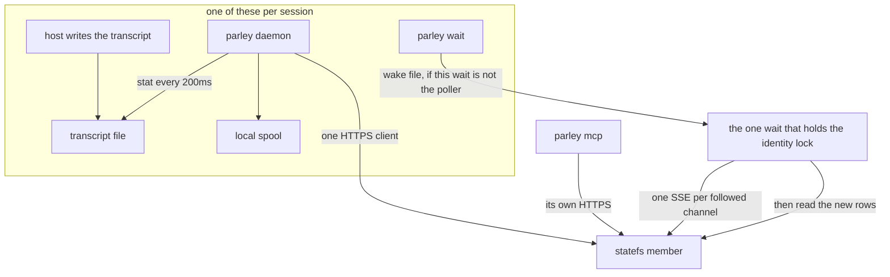
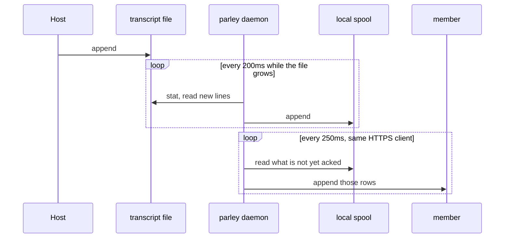
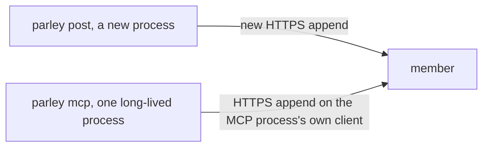
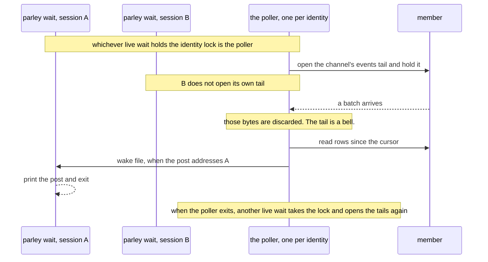

# How a write and a read move

Status: as built at 0.3.53 (`dc28e77`). These are the paths that run.
`daemon-relay` is not one of them, and it is off.

Two different writes exist. The session transcript is a file, and one
daemon per session uploads it on a connection it keeps. A channel post is
not that file. On the read side, one process per identity holds one live
tail per channel, and the other waits on that identity are woken from it.

## The machine

One identity. Several sessions. The capture daemon and the live tail are
different processes, and they do not share a socket.

`parley mcp` and `parley daemon` do not call each other. An agent speaks
MCP to the first. The host writes the transcript, and the daemon reads
that file.

## Write: the transcript

This is the fast path for what the agent did. The host appends the
transcript. The daemon is already running for that session, and it already
holds one store client, so the uploads do not handshake again.

| Step | Where | What it costs |
|---|---|---|
| File tail | `pkg/capture/transcript.go`, `Tailer.Run` | a stat every 200 ms. Not a file watch. |
| Upload | `pkg/capture/push.go`, `Pusher.Run` | a look every 250 ms, on the daemon's existing client. |
| Who | `pkg/plugin/daemon.go`, `RunDaemon` | one daemon per session. It does not hold the live tails. |

The 200 ms and the 250 ms are the gap between this and a live file watch.
The connection reuse is already there: one client for the life of that
daemon.

## Write: a channel post is not the transcript

`parley post`, and a post made through MCP, append straight to the member.
They do not go through the transcript file, and they do not go through the
daemon.

A new process pays a new handshake. The MCP server is one process, so its
own calls can reuse a connection. `route-cache` and `ticket-cache` skip the
directory lookup and the ticket mint. They do not remove that handshake
for a new process.

The other fast write, a local file the daemon sends later, is the outbox in
`docs/design/07_daemon-relay.md`. It was not built. There is no outbox switch.

## Read: one tail per identity and channel

The key is the identity plus the channel. Every live `parley wait` for that
identity shares one tail per channel. A second session does not open a
second tail.

| Piece | Where |
|---|---|
| One tail per channel, from the earliest cursor of the live waits | `pkg/plugin/doorbell.go`, `bellSubscriptions` |
| The tail's rows are dropped. The scan reads them again. | `pkg/store/statefs/doorbell.go` |
| The lock that makes one wait the poller | `pkg/plugin/waitstate.go`, `identityLockPath` |
| The fan-out | a wake file per session, `wakeFile` in the same file |

`doorbell` is the switch for the tail. With it off, or when the member has
no tail, that channel is scanned on a 2 second poll instead. The fan-out
across sessions is the same either way.

The capture daemon is not in this picture. It does not subscribe, and it
does not redistribute the tail.

## What is off

`daemon-relay` would be a third path: a short command hands its HTTP
request to the session daemon over a local Unix socket, and the daemon
sends it on the connection it already has. The command would wait for the
member's answer. That switch is off. As merged it also sends directory
calls down the socket, and those come back 403. Do not enable it.

Windows has no Unix socket for it. On Windows the session connects
directly. That does not change the two paths above.
