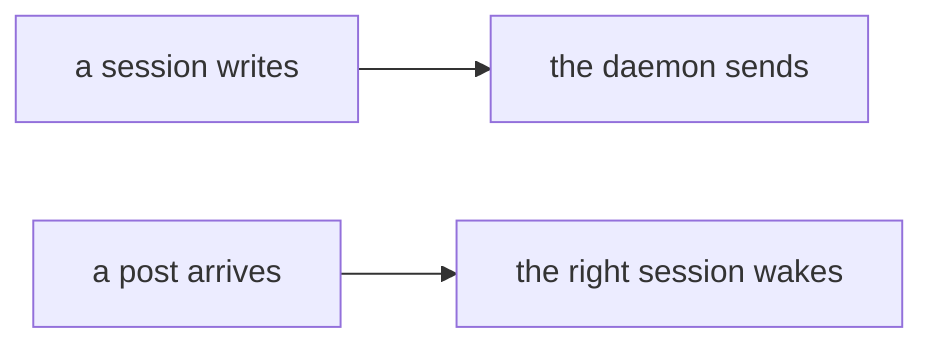
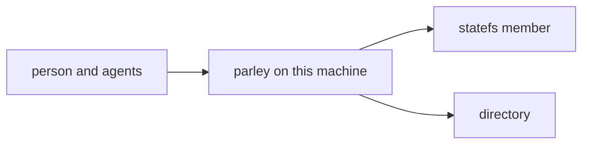
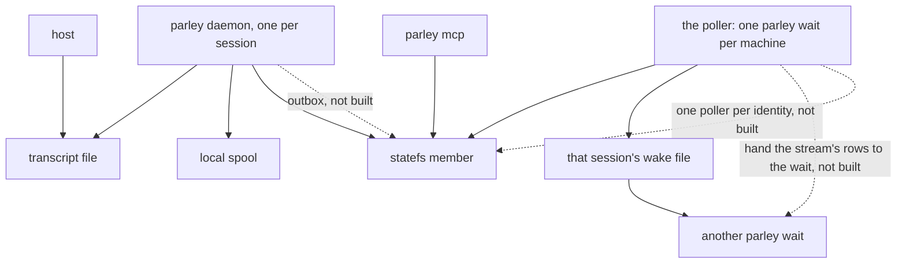
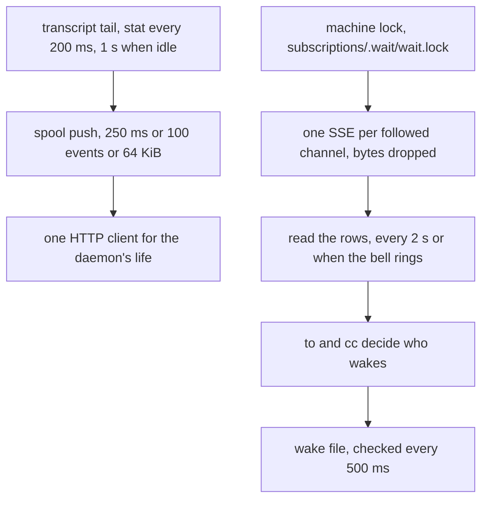
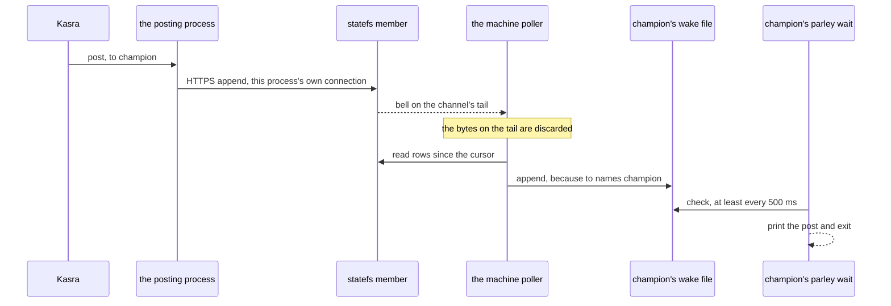
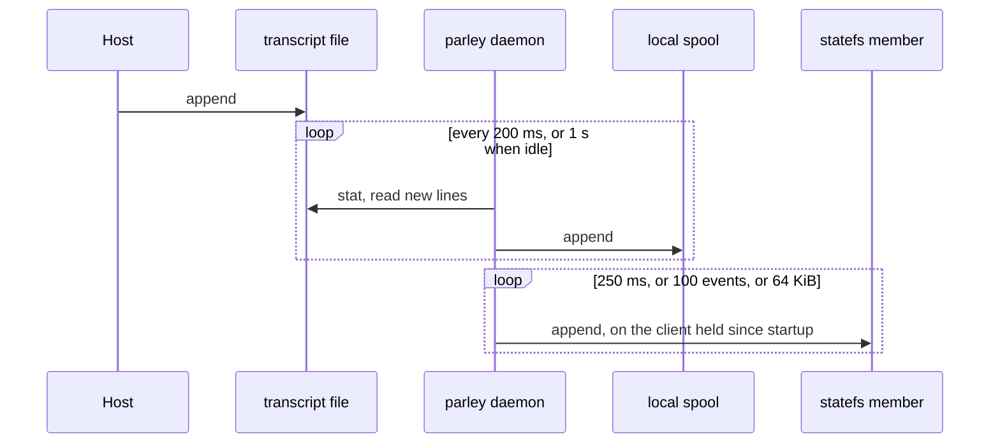
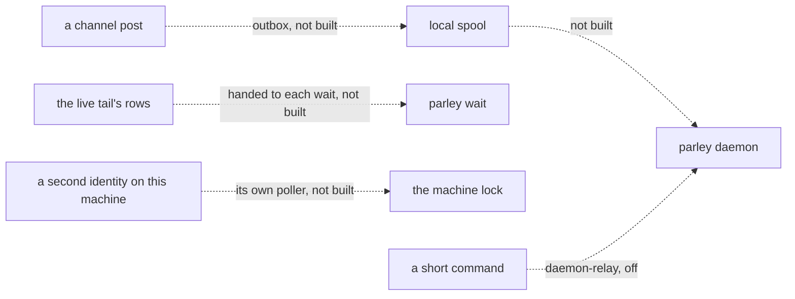

# How a write and a read move

Status: as built at 0.3.53 (`dc28e77`). Solid arrows run today. Dashed
arrows do not: each one is labelled. `daemon-relay` is off.

## Plain words

A session writes a transcript file. That session's daemon reads the file
and sends the rows to statefs on one connection it keeps. A post on a
channel is a different write: the process that posts connects to statefs
itself.

A post arrives at the member. One `parley wait` on the machine is the
poller. It hears a bell on the channel, reads the new rows, and writes a
wake file for the session the post names. That session's wait prints the
post and exits.

Worked example. Kasra posts on the portal channel, addressed to champion.

1. The portal's post is its own HTTPS append to the member. It does not
   go through a transcript, and it does not go through `parley daemon`.
2. One wait on this machine holds
   `~/.statefs-ai/subscriptions/.wait/wait.lock`. That lock is per data
   directory, which is one per machine, not one per identity
   (`pkg/plugin/shared.go:54`, `pkg/plugin/waitstate.go:100`,
   `pkg/plugin/wait.go:246`).
3. That poller already has one live tail open for the channel. The tail
   is a bell. The bytes on it are discarded
   (`pkg/store/statefs/doorbell.go:107`).
4. The bell wakes a read of the new rows. With no bell, that read happens
   every 2 seconds (`pkg/plugin/wait.go:49`).
5. The post's `to` is champion, and `cc` is empty. A session is woken when
   `to` or `cc` names it, and also when either is everyone
   (`pkg/plugin/shared.go:965`, `pkg/plugin/shared.go:980`,
   `pkg/plugin/wait.go:639`). Champion's session gets a line appended to
   its wake file (`pkg/plugin/wait.go:740`). The other sessions do not.
6. Champion's `parley wait` checks that file at least every 500 ms
   (`pkg/plugin/wait.go:315`), prints the post, and exits. The next wait
   continues from the cursor this one stored.

## C0. One picture

A session writes, the daemon sends. A post arrives, the right session wakes.

## C1. Context

The person and the agents are on one machine. statefs is the member that
stores the channel and the directory that says which member that is.
Parley is the only thing on the machine that talks to them.

## C2. Containers

Five processes matter. The host is not a parley process. The daemon, the
MCP server, and each `parley wait` are. The poller is whichever wait holds
the machine lock. statefs is not on the machine.

The three dashed arrows are the gaps. Today the daemon uploads the
transcript only. Today the poller throws the stream away and reads again.
Today there is one poller for the machine, and it uses its own store, so
two identities on one machine share that poller.

## C3. Components

What each box actually does, and the line that sets the number.

| What runs | Where |
|---|---|
| Tail every 200 ms, or 1 s when the file is idle | `pkg/capture/transcript.go:84` |
| Push every 250 ms | `pkg/capture/push.go:53` |
| Flush at 100 events, 64 KiB, or 250 ms | `pkg/conversation/conversation.go:132` |
| The daemon's one store client | `pkg/plugin/daemon.go:67` |
| The machine lock | `pkg/plugin/wait.go:246` |
| One tail per followed channel, from the earliest cursor | `pkg/plugin/doorbell.go:99` |
| The tail's rows are dropped | `pkg/store/statefs/doorbell.go:107` |
| The read, every 2 s unless the bell rings | `pkg/plugin/wait.go:49` |
| `to` and `cc` | `pkg/plugin/shared.go:965` |
| Wake file checked every 500 ms | `pkg/plugin/wait.go:315` |
| Client timeout that cuts a quiet tail | `pkg/store/statefs/statefs.go:56`, `vendor/github.com/quantumwake/statefs/client/client.go:95` |

The tail uses that client (`vendor/.../client/events.go:83`). `New` with a
nil client sets `Timeout` to 30 seconds, and that limit includes reading
the body. A tail that stays open is cut at 30 seconds and the reconnect
path runs (`pkg/store/statefs/doorbell.go:152`). This is the bound in the
client. A live tail was not stopwatched for this page. The 2 second read
still delivers the post while the tail is down. The longest a reconnect
waits is 30 seconds (`pkg/store/statefs/doorbell.go:167`).

## C4. A channel post

Kasra posts, addressed to champion. Solid is today.

A post from `parley post` pays a new handshake. `plugin.Post` builds a
fresh store on every call (`pkg/plugin/shared.go:305`,
`pkg/plugin/storeenv.go:29`). That client leaves `Transport` nil
(`vendor/github.com/quantumwake/statefs/client/client.go:95`), so any
reuse is `http.DefaultTransport`'s pool, which is shared by every client
in the same process. A new process does not share it. The MCP server is
one process, so its calls can. Neither path is the transcript.

If no capture daemon is running, this sequence does not change. A channel
post never needed the daemon. The transcript path below is the one that
stops.

## C4. A session write

The host appends the transcript. The daemon is already running.

No daemon, no upload. The file sits until a daemon for that session is
running. There is no second path that sends the transcript.

## C4. What is not built

Drawn so they are not mistaken for the sequences above.

`daemon-relay` would hand a short command's HTTP request to the session
daemon over a Unix socket. It is off. As merged it also sends directory
calls down that socket, and those come back 403. On Windows there is no
such socket, and the command connects directly. That changes nothing in
the solid diagrams.

## Gaps

- A channel post is its own process and its own handshake. The outbox
  that would make talk posts a file write was designed and not built.
  Work posts stay synchronous: the server's answer is the point.
- The poller is one per machine, not one per identity. Every seat on this
  machine is one identity, so it works here. A second identity would be
  scanned with the poller's store.
- The live tail is a bell plus a second read. The rows are not handed to
  the waits.
- The transcript tail and the spool push are short polls, not a file watch.
- A quiet tail is cut by the 30 second client timeout. The number is that
  timeout. It was not timed on a live socket.
