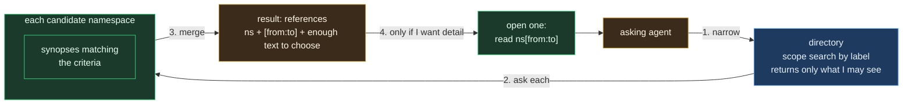

# Teams and synopses: the two things statefs.io does not give us

Status: proposed. Nothing here is built.

## The problem

Two things statefs.io does not provide, and a product on it needs.

**Sharing with a group.** A grant names one identity. There is no way to say
"the platform team may read this", only to grant each member.

**Finding a conversation by what was said in it.** The directory searches
labels, which say how a conversation was tagged, not what it contains. And
nothing ties a summary to the exact part of a conversation it describes.

## The answers, in one line each

- A **synopsis** is a summary of a range of one conversation, `ns[from:to]`,
  stored as a row and checkable by replaying that range (§1).
- **Search** runs against index namespaces that hold synopsis rows, one query
  each, and returns references the agent can open (§2, detailed in
  [search](02_search.md)).
- Indexing inside a conversation is the engine's job; statefs.ai builds no
  index of its own (§2a).
- A **session log** is summarised by its own capture daemon; a **shared
  conversation** by a background job the owner has granted (§2b).
- A **team** is a namespace of membership rows, expanded into per-member
  grants until core has a group grant (§3).
- **Access never changes**: who may see a synopsis follows from grants on
  the namespace that holds it, like any other row.

## 1. The unit: a range of a namespace

The address the user proposed is the right primitive:

```
<namespace>[<from>:<to>]
```

Positions in statefs are assigned by the engine, are stable, and never
change, so a range is a durable citation. That gives the whole design a
property worth stating plainly: **a synopsis is checkable**. It claims to
summarise rows 100 to 250 of a channel, and anyone with read access can
replay exactly those rows and judge it. Nothing else we store today has
that. It is the same discipline as the rest of the product: the record is
the truth, and everything derived from it says which part it came from.

A synopsis is a row in the channel it summarises, not in a side store:

| Field | Value |
|---|---|
| `kind` | `meta.summary` |
| `content.range` | `[from, to]`, the positions covered |
| `content.text` | the synopsis itself |
| `content.model` | what wrote it |
| `indexable` | `true` |
| `identity`, `participant` | who produced it, self-declared as always |

Keeping it in the channel means it inherits the channel's grants exactly,
replays with the conversation, and needs no separate lifecycle. Several
agents may summarise the same range and each result is kept as a
perspective, which PRODUCT-PLAN §3.12 already specifies through
`post.request` and `post.claim`. Those kinds exist, and `post.request`
already carries a range.

**No vector is stored yet.** An embedding is only useful to something that
ranks with it, and nothing does; see §2. When that changes, the embedding
belongs in a rebuildable lookup copy, never in the row.

## 2. Search: per namespace, returning synopses you can open

Access does not change here. Who can see a synopsis follows from grants on
the namespace holding it, like any other row. The only access gap in this
document is teams (§3), and that is a missing primitive in core, not a new
model in the product.

**An index belongs to a namespace,** like everything else in statefs:
declared on it, built from its own rows, replicated with it. That single
fact removes the whole problem. An index over a namespace's synopses is
readable exactly by whoever may read the namespace, because it *is* part of
the namespace. There is no spanning store, no cross-tenant copy to protect,
and nothing to filter at query time. Authorization stays where it already
works.

### The shape of a query



0. **Learn the vocabulary.** An agent cannot narrow by label unless it knows
   which labels exist, so `list_labels` (CLI: `parley labels`) reports the
   scope keys in use and, for the enumerable ones, their values with counts:
   `mode` is agent or shared, `tags` are these six, `date` spans these days.
   Free-text keys (title, description, session) are reported as present but
   not enumerated, because listing them is noise.

   **This belongs in the directory, not in the client.** Scope is JSONB
   behind a GIN index and the catalogue is one grouped query over the rows
   the caller may already see. Doing it client-side means paging every
   namespace's metadata to count its keys, and capping, so past the cap a
   sample is presented as a catalogue — wrong, not merely slow. statefs.ai
   ships the client version as a stopgap that says when it truncated;
   recorded as delta 11 in the core handoff, and it is deleted when the
   endpoint exists. This is the same call as §2a: an aggregate over stored
   data is the engine's job, not the application's.
1. **Narrow.** The directory answers which conversations carry these labels,
   and it already returns only what the caller may see. This works when the
   asker knows a label. When they do not, which is the whole point of a
   semantic question, narrowing achieves nothing and §2a's discovery index
   is what answers instead.
2. **Ask each candidate namespace** for synopses matching the criteria.
3. **Merge** into a result set of *references*: the namespace, the range,
   and enough text to decide. Not the content.
4. **Open one, if the agent wants it.** That is a read of `ns[from:to]`,
   the ordinary scan it can already do.

The two-step is the point. A search answer stays small, and the expensive
part happens only for the ranges an agent actually chooses.

### This works today, unchanged, with no index

Step 2 is "find the `meta.summary` rows in this namespace that match". With
no index that is a scan of its summary rows, which are few compared with its
content rows. With an index it is a lookup. **The architecture is identical
either way**: an index changes only how one namespace answers step 2, never
the shape of the query, the access model, or the result.

So the label-first path ships now. It is not the general answer, though:
without a label the candidate set is everything readable, and §2a explains
why that needs a central index rather than a wider fan-out.

### As tools

Two additions to the MCP surface, matching the two steps:

| Tool | Does |
|---|---|
| `list_labels` | the filterable vocabulary: which scope keys exist and their values |
| `search_synopses` | criteria plus optional labels; returns references (namespace, range, text) |
| `open_synopsis` | reads the cited `ns[from:to]` and returns those rows |

## 2a. Two different indexes, and only one of them is the engine's

A per-namespace index answers "where in this conversation". It cannot answer
"which conversation", because finding out whether a namespace is relevant
means asking it, and asking every namespace a caller can read is a
scatter-gather across every node, per query. Labels only narrow that when
the asker already knows a label, and a semantic question is exactly the case
where they do not.

### So there are two indexes, with different owners

| | Intra-namespace | Cross-namespace discovery |
|---|---|---|
| Question | "where in *this* conversation" | "*which* conversation" |
| Unit | a row | a namespace, or a synopsis range within one |
| Belongs to | the namespace, so the engine: P15, and a vector column type eventually | something central, keyed by `(namespace, range)` |
| Grant scoping | free: it is part of the namespace | must be applied when candidates are resolved |
| Status | P15 adopted, unbuilt | nothing, anywhere |

The engine half of the earlier conclusion stands: we do not build a
row-level index outside the engine. The discovery half was wrong. A
centralised structure is not a convenience here, it is the only thing that
can answer the question at all.

### Where the discovery index should live

Two candidates, and the choice turns on who else needs it.

**The directory.** It is already the cross-namespace catalogue, it already
answers a search scoped to what the caller may see, and that access scoping
is the hard part. Adding vectors beside the scope column is a small
extension of something that exists, it needs no model in core (it would
accept vectors the product computed, and index floats), and every
application on the engine gets discovery rather than only ours.

**statefs.ai.** Faster to build, no core dependency, and free to iterate on
ranking. The cost is that we re-implement the access filter that the
directory already has, and a second application would build it again.

The trade is not the one in the old §2a. This is not "the engine's job done
worse"; the directory does not have this today either. It is a question of
whether discovery is a platform capability or a product feature. Recorded as
a decision for the user, with the directory as the better long-term home if
one is built at all — see the fan-out comparison below, which argues that
nothing central should be built yet.

### Fan-out versus a central index

Fan-out means probing the namespace indexes the caller already owns or is
granted, after narrowing by date and label. Compared with one central index:

| | Bounded fan-out | Central discovery index |
|---|---|---|
| Access | **free and exact**: you only probe what you can read, and each probe is authorised by the engine | needs a filter on the way out |
| Freshness | always current; a post a second old is found | lags whatever pushes into it |
| Infrastructure | none | a service, a sync path, a rebuild story |
| Cost driver | the candidate count after filtering | index size, which one structure absorbs |
| Cold data | index-only probes read index segments, not blocks (see below); a cold *segment* may still be fetched, but it is small | one hot structure |
| Breadth | degrades as the candidate set grows | flat |

**Date is the strong filter, and it is the right one.** Conversations have a
recency prior: the answer to "what did we decide about retries" is usually
recent, and `date` is already a scope label, so the narrowing happens in the
directory before any probe. A single person's last thirty days is hundreds
of namespaces, not thousands.

**Two core capabilities decide how far fan-out stretches**, and both are
smaller asks than a central service:

1. **A batched multi-namespace probe.** Today the query service is
   explicitly *one query = one namespace* (STATEFS-CAPABILITIES §Query,
   ~52 ms warm). So a fan-out over 300 namespaces is 300 calls. If a member
   could answer "search these 40 namespaces I hold", the cost becomes
   O(members) rather than O(namespaces), which is a different curve
   entirely.
2. **A per-namespace vector index** (P15 plus a vector type), so each probe
   is an ANN over a handful of synopsis vectors instead of a scan.

**Recommendation: fan-out first, and measure.** It needs no new service, it
is correct on access by construction, it is always fresh, and it is the only
way to learn the distribution that decides the question. The decision rule
should be written down now, before either is built:

> Build the central index when the p95 candidate count after date and label
> filtering, for a real caller, exceeds what a batched probe can answer
> inside a turn. Until that number exists, a central index is a guess.

The two are not exclusive either. A central index over *namespace-level*
vectors — one per conversation, not one per range — would be small, cheap to
keep fresh, and would serve only to pick which namespaces to fan out to.
That is a smaller thing than a full synopsis index and it is probably where
this lands if fan-out runs out of room.

### What an index probe costs

In RFC-0010 §2 an index is a set of segments flushed beside the block at
seal, and every type answers in positions: hash gives value to a posting list, btree gives position
ranges, bitmap gives roaring bitmaps over positions, zonemap prunes blocks.
A probe reads index segments and returns positions. It does not read the
Parquet blocks unless the caller then asks for rows.

So a "does this namespace have anything relevant" probe is index-only. An
index segment for a cold namespace may itself sit in the tier, but a segment
is small next to a block.

### The query stories, and which surface answers each

statefs has four read surfaces with different costs, and the design is only
sound if each step uses the right one. Being careless here is how a search
ends up dragging blocks around.

| Story | Surface | Returns | Reads data blocks? |
|---|---|---|---|
| "What can I filter on?" | directory scope aggregate (delta 11) | label keys and values | no |
| "Which namespaces and ranges match this text?" | **query service over one index namespace** | references: source namespace, range, text | yes, but only that one small namespace |
| "Where in *this* conversation?" | query service over that conversation, or its indexes | positions or rows | yes |
| "Show me that range" | member read on the source namespace | rows | yes, and only on demand |
| "Catch up on a channel" | member scan from a cursor | rows | yes |

Two things that stop a probe from being free:

- **P15's index read surface returns positions and nothing else**
  (`/admin/index/{ns}/{name}/postings|range|bitmap-counts`). They are admin
  control endpoints, consumed by the P14 pruner to narrow a block list.
  Serving a whole query from indexes is E2, which RFC-0010 explicitly defers
  and says nothing there presupposes.
- **The query service does read blocks.** One query equals one namespace,
  with an access layer, about 52 ms warm. That is the right tool, but it is a
  row-reading tool, not a metadata peek.

### The design: one index namespace, one query

The objective is narrow and worth restating: **from the plugin or an MCP
tool, find the namespaces and ranges whose text matches, limited to what the
caller's identity is granted.** Nothing more.

That is answered with no core changes at all.

1. The product writes synopsis rows into an **index namespace**: one row per
   summarised range, carrying `source_ns`, `[from, to]`, the text, and later
   an embedding column. One index namespace per access domain — a person's
   own, a team's — never one spanning domains.
2. A search is **one query against that namespace**. This is exactly the
   shape the query service is built for, and our own capabilities note
   already anticipated it: *"Per-conversation analytics only; cross-conversation
   needs product-side index namespaces."*
3. The result is references. The agent opens one if it wants detail, which is
   an ordinary member read of the source range, authorised by the source
   namespace's own grants.

Why this is the thoughtful version rather than the clever one:

- **No fan-out.** One query, not a probe per conversation, so delta 12's
  batched probe is not needed.
- **No new index type.** Text matching in the query engine is enough to
  start, and even vector ranking is a brute-force scan over a few thousand
  rows in a small namespace before it needs an index.
- **No payload in an index**, so nothing pushes on E2, which the RFC
  deliberately left closed.
- **No new storage system**, no sync protocol, no second access model.
- **Block reads are confined** to one small, hot namespace, and to source
  ranges the agent explicitly chose.

The withdrawn asks are as important as the kept one: **deltas 12 and 13 are
withdrawn** (see the core handoff), because this design needs neither, and
asking for an index payload would have pushed core into a decision it had
already deferred on purpose.

The paths are drawn out end to end in [SEARCH.md](02_search.md).

### What is actually unresolved

- **Is text matching enough?** If not, ranking by embedding is a scan of the
  index namespace before it is ever an index. Only if that scan is too slow
  does a vector index type become a real ask, and it would then be an
  ordinary per-namespace index on the index namespace.
- **What does the query service's AST gate allow?** The predicate we need
  (text match, plus a date bound) has to be inside it. Worth confirming
  before building.
- **Who writes into the index namespace**, given §2b puts synopses in the
  source conversation. Either the writer appends to both, or a reconciler
  copies. This is the one genuinely new mechanism and it deserves its own
  decision rather than an assumption.

### The access rule, restated precisely

Access still follows from grants on the namespace, and nothing new is
invented. But a discovery index does hold references drawn from namespaces
with different grants, so one rule has to be honoured when answering:

**Resolve candidates against the asker's grants before returning anything,
including snippets.** Returning a summary excerpt from a namespace the asker
cannot read would leak content that the eventual `open` would correctly
refuse. Filtering first is cheap, uses the grants that already exist, and
costs one access check per candidate.

This is one filter on the way out, not a second authorization model.

## 2b. Who writes the synopsis

Two candidates: a live agent on the namespace, or a background job. The
answer is both, split by the kind of conversation, because the two kinds
differ in exactly the way that decides it.

### The split

| | Session log (`mode: agent`) | Shared conversation (`mode: shared`) |
|---|---|---|
| Writers | one | many |
| A natural end | yes, `session.end` | no, it runs indefinitely |
| Who summarises | **the agent itself, at session end** | **a background job** |
| Duplicates | impossible: one writer, one boundary | needs a single writer, which the job is |
| Coverage | complete: every session ends | complete: the job does not wait for anyone |
| New access | none: it already wrote the rows | a grant per namespace, opt-in (below) |
| Infrastructure | none | the M5 job runner |

**Session logs settle themselves.** The summariser is the session's own
capture daemon, on a cadence during the session and once more at the end
(see [search](02_search.md) §3). It is the party that has the content and is
not busy. The agent that just ran is the obvious summariser: it has the content, it has a model, it has write access because
it owns the namespace, and `session.end` is a deterministic trigger that
happens exactly once. One session yields one synopsis, with no contention
and nothing to deploy. It also fixes a complaint that predates this
document: without a description, a list of sessions is impossible to search.

**Shared conversations do not.** They have no end, so there is no natural
moment; and many writers, so an opportunistic summariser races the others.

### Why not a live agent on a shared conversation

The design in PRODUCT-PLAN §3.12 has a reader post a `post.request` when
enough rows have accumulated, with `post.claim` as an advisory signal. Three
problems, and the first is fatal for search:

1. **Coverage depends on attendance.** A channel nobody reads is never
   summarised, so a search returns whatever happened to have an audience.
   That makes results arbitrary in a way a user cannot see.
2. **Duplicates.** An advisory claim does not stop five agents answering the
   same request. Multiple perspectives are a feature when someone asks for
   them and waste when nobody did.
3. **It spends the user's turn.** An agent pausing mid-task to summarise a
   hundred rows is a tax on a session the user is paying for and did not ask
   to spend this way.

### What makes the background job acceptable

The obvious implementation is the dangerous one: a service identity granted
read on everything. That is precisely the broad principal this document has
argued against, and compromising it would read every channel in the tenant.

**So the job holds no blanket access. A conversation opts in, by its owner
granting the job read and write on that namespace.** Consequences, all of
which are good:

- Access stays per-namespace and consented, like every other grant.
- It is revocable, and revoking it stops future summaries without touching
  the ones already written.
- A private channel is summarised only if its owner chose that.
- The job's blast radius is exactly the set of channels that opted in, and
  that set is inspectable by listing its grants.

The job writes as its own identity, so a synopsis is attributable to it and
distinguishable from a participant's, and it is checkable against the range
like any other.

### Order of work

Session-end summaries first: they need no infrastructure, no new grants and
no scheduler, and they make the session index searchable. The job follows at
M5 for shared conversations, and until it exists a shared conversation is
summarised only if a participant chooses to, which is honest as long as
search results say a channel has no synopsis rather than implying it has
nothing worth finding.

## 3. Teams

A team is a named group of identities that can be granted access as one
thing. statefs has no such object: a grant names one membership.

**Proposed:** a team is a namespace, like a persona or an agent, whose rows
are its membership history.

| Field | Value |
|---|---|
| scope | `kind: team`, `name`, `description` |
| rows | `team.member.added`, `team.member.removed`, each naming an identity and who changed it |
| current membership | the fold of those rows |

Sharing a channel with a team records the intent and then reconciles:

1. a `grant.team` row on the channel names the team and the access,
2. statefs.ai expands it into one statefs grant per member,
3. a reconciler re-runs the expansion when the team changes.

This is honest about the mechanism rather than pretending core has groups.
Three properties follow, and all three should be stated to users:

- **Grants drift until reconciled.** Someone added to a team gains access
  when the reconciler next runs, not instantly. Removal is the case that
  matters, and it should be reconciled immediately rather than on a timer.
- **It is O(members × channels) grant rows.** Fine for a team of twenty,
  uncomfortable at a firm of hundreds across many channels.
- **Attribution is unaffected.** Members still act as themselves. The
  alternative, a shared team identity everyone acts through, would destroy
  the attribution we spent this design establishing, and is rejected for
  that reason.

The scaling and the drift both disappear if statefs learns a group grant.
That is the core ask, recorded below rather than assumed.

## 4. Who computes what

Unchanged from the boundary in FEATURES.md, and worth repeating because it
is what keeps the engine model-free:

| Work | Where | How |
|---|---|---|
| store rows, assign positions, enforce grants | statefs.io | as built |
| index a column it already stores | statefs.io | P15, adopted and unbuilt |
| summarise a session log | the agent that ran it, at `session.end` | one writer, one boundary (§2b) |
| summarise a shared conversation | the job runner at M5, where the owner granted it | `meta.summary` with a range (§2b) |
| answer "which synopses match" within a namespace | statefs.io | a scan today, an index once P15 lands |
| narrow, merge and present the result | statefs.ai | §2 |
| judge which synopsis to open | the asking agent | it reads the references and chooses |

No product process calls a model. Agents do, which is the rule we set on
day one and have not broken.

## 5. What this asks of statefs core

Recorded for a handoff, not assumed:

1. **A group grant.** Grant read or write on a namespace to a group of
   memberships. Removes the reconciler, the drift, and the row explosion.
2. **Eventually, an index over synopsis rows in a namespace** — P15 applied
   to a column we already write, not a new subsystem and not a service on
   our side. Recorded as a direction: P15 is itself unbuilt, so asking for a
   semantic index type before the first four exist would be premature.
3. **Range-addressable reads.** We can already scan positions, so this is
   satisfied today; it is listed because the whole design depends on
   positions staying stable, which should remain an invariant.

## 6. Open decisions

1. **Does a participant-written synopsis stay possible at all?** §2b makes
   the job the writer for shared conversations. Keeping `post.request` and
   `post.claim` for a human or agent who deliberately asks for a second
   reading seems right, but then a claim must actually suppress duplicates
   for the opportunistic path, or that path should be dropped.
2. **How wide may a search fan out?** Step 2 touches every candidate
   namespace, so labels have to narrow well. A cap plus "narrow your
   criteria" is probably better than a slow unbounded search.
3. **Is a team a tenant-wide object or can anyone make one?** Creating a
   team is cheap; granting on behalf of one is not, since expansion needs
   `own` on the channel.
4. **Does a synopsis expire?** A summary of rows 100 to 250 stays true, but
   a "current state of this channel" summary does not. Ranges are honest
   and should probably be the only kind we write.
