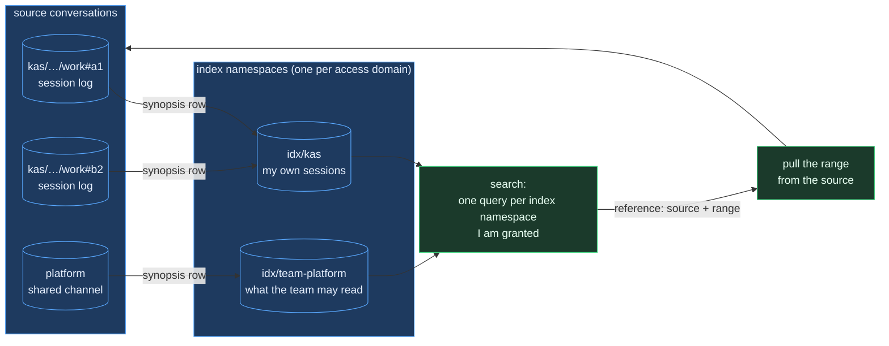
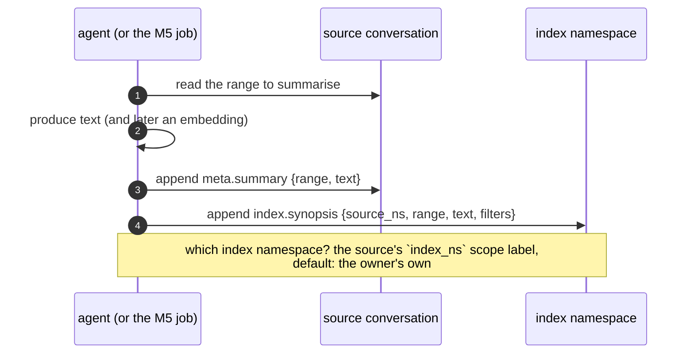
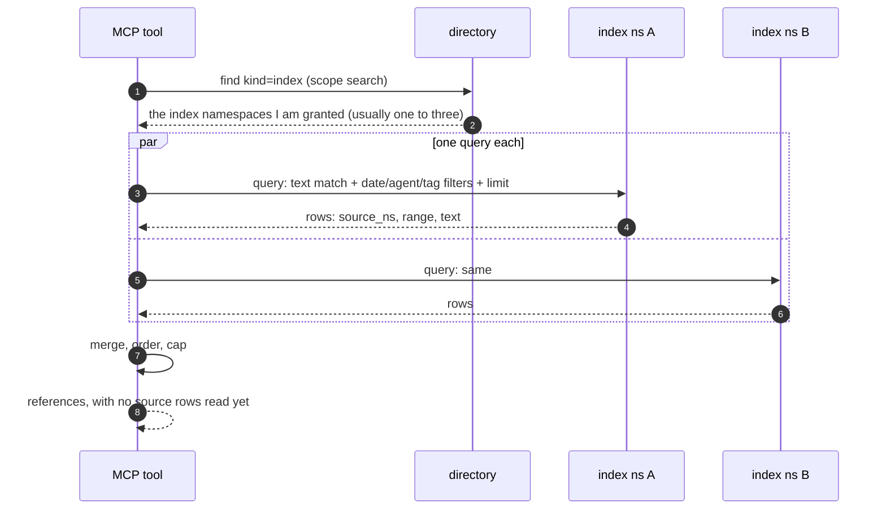
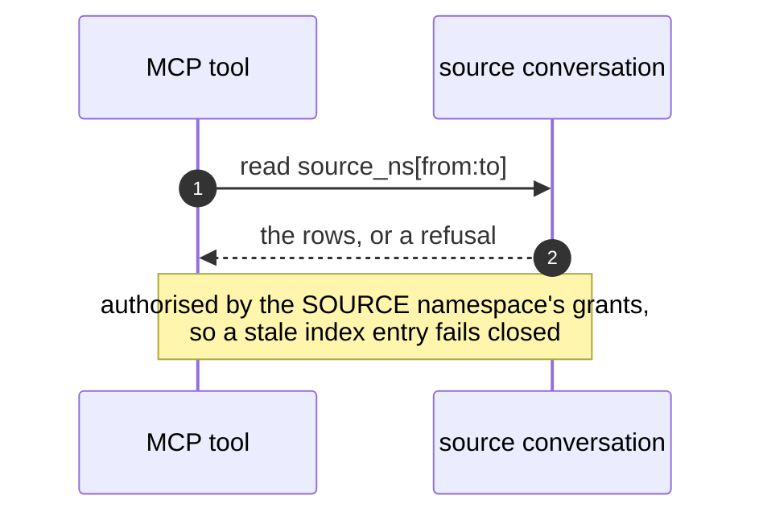

# Search: index namespaces, and the four paths

Status: sketch, not built. [Teams and synopses](01_teams-and-synopses.md)
argues *why*; this document sets out *how*, path by path.

## The problem

From the plugin or an MCP tool, find the conversations and the ranges within
them whose text matches a question, limited to what the caller's identity is
granted. Then let the agent open one.

## The answer

A synopsis of each summarised range is written into an **index namespace**:
an ordinary statefs namespace whose rows describe other namespaces. A search
is one query against each index namespace the caller is granted, usually one
to three. It returns references, and opening one is a normal read of the
source range, authorised by the source's own grants.

Nothing here needs a new service or any change to core. Indexes, when P15
ships, make the same queries cheaper.

## 0. How indexing works in statefs core (P15, as adopted)

Facts from [RFC-0010](../../../statefs/docs/rfcs/cluster/RFC-0010-indexes-and-native-query.md)
D1 and [P15](../../../statefs/docs/phases/P15-indexing.md). P15 is adopted
and not built. Everything below constrains this design.

| | |
|---|---|
| **Declared** | per namespace, on the directory record (`indexes: [{name, type, column}]`), at birth or by PATCH; fanout to members rides the cordon/durability path |
| **Types v1** | `zonemap` (implicit, always on), `hash`, `bitmap`, `btree` (sorted runs, no in-place tree). **No text index. No vector index.** |
| **Columns v1** | **top-level scalars only**; dotted paths into JSON are a fast-follow |
| **Maintained** | synchronous WAL tap; an index is a deterministic function of the WAL, so replicas converge independently and no index bytes cross the wire |
| **Stored** | `<ns>/index/<name>/epoch-<e>/seg-<rowStart>-<rowEnd>.<type>`, keyed by **position range, never block id**, so compaction remaps and never rebuilds |
| **Read surface v1** | member **control** endpoints returning **positions**: `postings`, `range`, `bitmap-counts`. Consumed by the P14 pruner to narrow a block list |
| **Serving queries from indexes** | that is E2, a later decision RFC-0010 explicitly defers |
| **Usable when** | the member reports `ready` at the current epoch in its heartbeat; readers must handle `building` |
| **Bitmap guard** | past 1,024 distinct values a segment downgrades to hash at seal, and says so |

### What that means for this design

1. **Core indexes cannot answer "find text".** There is no text or vector
   type, in v1 or in the adopted plan. So the text match in §5 is the
   **query service** (DuckDB over one namespace), not an index lookup. An
   index only ever prunes what the query reads.
2. **Filter columns must be top-level scalars.** `source_ns`,
   `source_date`, `source_agent`, `source_session` therefore sit on the row
   envelope, not inside `content`, or they cannot be indexed at all until
   dotted paths land. This is why §2 promotes them.
3. **Indexes are an optimisation here, never the mechanism.** On an index
   namespace they would buy: zonemaps on `ts_ms` for date pruning, `hash` on
   `source_ns` for "everything about this conversation", `bitmap` on
   `source_agent`. All of that narrows a scan; none of it finds text.
4. **Nothing blocks us.** P15 is unbuilt, and this design does not need it.
   When it lands we declare the three indexes above and the same queries get
   cheaper.

## 1. The shape

An **index namespace** is a normal statefs namespace whose rows are
synopses of *other* namespaces. It carries `kind: index` in its scope, and
one row per summarised range.

### The rule that fixes the granularity

**An index namespace is an access domain. Its grants are the enforcement,
and a predicate inside a query is not.**

A `WHERE identity = me` clause narrows results; it does not stop a caller
issuing a different query. So an index namespace may only aggregate
synopses of conversations that *everyone granted on it* can already read.
That gives the natural set:

| Index namespace | Aggregates | Granted to |
|---|---|---|
| one per person | their own session logs | that person |
| one per team | the channels that team may read | the team (§3 of the companion) |
| one per tenant | only tenant-readable conversations | everyone in the tenant |

"One per tenant or many per tenant" is therefore answered by counting access
domains, not by taste. Scope filters on identity, session, agent and date
still travel in the rows, but they are for **relevance**, not security.

## 2. The synopsis row

| Field | Meaning |
|---|---|
| `kind` | `index.synopsis` |
| `content.source_ns` | the namespace summarised |
| `content.range` | `[from, to]`, stable positions in that namespace |
| `content.text` | the synopsis |
| `content.model` | what produced it |
| `identity`, `participant` | who produced it, self-declared as ever |
| `ts_ms` | when the summarised range happened, for date narrowing |
| top-level columns | `source_ns`, `source_agent`, `source_session`, `source_date` — **top-level, not inside `content`**, because P15 v1 indexes only top-level scalars (§0) |

The same synopsis is also appended to the **source** conversation as a
`meta.summary` row, where it inherits that conversation's grants and replays
with it. The index namespace holds the searchable copy. If the two disagree,
the source wins, and the index is rebuildable from it.

## 3. Write path

### Cadence: not only at session end

Waiting for `session.end` is insufficient. A session can run for hours, and
an index that only learns about it afterwards cannot answer a question asked
in the middle of it. Synopses have to be written **during** a session.

There are three ways to trigger one, and the third is the right one.

| Mechanism | How | Why not / why |
|---|---|---|
| Inject a request into the user's turn | `UserPromptSubmit` already returns `additionalContext`; it is how shared-conversation posts reach the model today | Works, and costs nothing to build. But it spends the user's turn and tokens on background work they did not ask for, mid-task, and the agent may do it badly or ignore it |
| `post.request` rows | already in the envelope, already carries a range | Right for asking *participants* of a shared conversation. Wrong for a session log, which has exactly one participant: the agent that is busy |
| **The capture daemon** | it already runs for the whole session, holds the spool, knows the namespace and every delivered position | It is the only party that has the content and is not busy |

**The daemon is the summariser.** It already receives every row with its
position through `OnDelivered`, so it knows precisely how much has arrived
since the last synopsis, at no extra cost.

**Trigger.** A synopsis is written when both hold, evaluated at a turn
boundary:

- **content**: rows delivered since the last synopsis exceed a threshold, so
  a quiet session never triggers; and
- **time**: enough has elapsed since the last one, so a busy session does not
  summarise every few seconds.

The user's suggestion of a timer plus "was there content" is exactly this,
with one refinement: **cut the range at a turn boundary**, not wherever the
timer fires. The daemon sees a new `user.message` row, which means the
previous turn is complete, so it summarises up to the position before it. A
synopsis of half a turn is worth much less than one of a whole turn.

**Ranges are contiguous and non-overlapping**, each starting where the last
ended. That makes them composable: a question about a longer span reads
several synopses in order rather than needing one that spans them.

**The checkpoint is the index itself.** "Where did I get to" is the end of
the last synopsis row for this source namespace, which is a query against
the index namespace. No local bookkeeping to lose, and a daemon that dies
mid-session resumes correctly on the next run.

**Who calls the model.** The daemon spawns a headless agent rather than
calling a model API itself. That keeps the standing rule literally true —
agents summarise, product processes do not — and, more practically, it needs
no new credentials, since it uses the Claude Code auth already on the
machine. The swarm driver is the precedent.

**Consent and cost.** This spends tokens the user did not explicitly ask to
spend, so the cadence must be visible in `parley status` and adjustable, and
summarisation must be switchable off. A background process quietly billing
someone is not acceptable, however useful the index is.

### Compaction summaries are free synopses (verified 2026-09-09)

When a session compacts, Claude Code writes a summary of everything it is
about to drop. That is a model-written synopsis produced at no cost to us,
and it is already on disk in the transcript we tail. Two records, confirmed
by reading a real transcript:

| Record | Carries |
|---|---|
| `type: system`, `subtype: compact_boundary` | `compactMetadata`: `trigger` (`auto` or manual), `preTokens`, `postTokens`, `cumulativeDroppedTokens`, `durationMs`. Its own content is only the words "Conversation compacted" |
| `type: user`, `isCompactSummary: true` | the summary itself, in the message content — about 30,000 characters in the session examined |

**We drop both today.** The tailer emits only `assistant.text` and
`assistant.thinking`, so the compaction summary never becomes a row. Nothing
is lost from the *record*, because our rows were pushed as they happened, but
the artifact that explains a compacted session in one place is thrown away.
That is the same class of gap as the injected context noted in
[PATHS.md](../architecture/06_paths.md) §5: something the session produced that the log does not
contain.

**It goes to the index, not the conversation.** Writing it
into the channel would need special-casing a row kind that is neither a turn
nor a deliberate summary, for no reader benefit. As a synopsis row it needs no
special treatment at all: the boundary gives a position, so the range runs
from the last synopsis to the row before it, and the text already exists at
zero token cost. Provenance is marked as compaction, since it was written to
help a model continue work rather than to be searched, and it is trimmed for
the snippet.

**One consequence to accept:** unlike every other synopsis, this one cannot be
regenerated by replaying the source, because Claude Code produced it once. An
index rebuild re-summarises those ranges fresh instead of recovering it. That
is acceptable — the index is a lookup copy and the source rows are intact —
but it means the index is not byte-reproducible from the log.

**It is a bonus, not the cadence.** Compaction fires when the context window
fills, which may be hours apart and never happens in a short session. So the
daemon's content-and-time trigger stays the mechanism, and a compaction
simply satisfies one interval for free when it lands.

**Session end still matters**, for the tail: the final range, from the last
synopsis to `session.end`.

Two things this settles:

- **Who writes.** A session log is summarised by its own capture daemon, on
  the cadence above, with a final range at `session.end`: one writer, so no
  duplicates. A shared channel is summarised by the job, which the channel's
  owner has granted.
- **Which index namespace.** The source conversation declares it, with an
  `index_ns` scope label set by its owner. Default is the owner's own index
  namespace. A channel readable by two teams names two, and the writer
  appends to both. Nothing infers the routing.

## 4. Read path (unchanged, and listed so it is not confused with search)

Following a conversation is what parley already does: a member scan from the
subscription cursor, rows returned in position order, grants enforced by the
engine. Search does not touch this path, and this path does not touch the
index.

## 5. Search path

**This is the fan-out, and it is over index namespaces, not conversations.**
A caller has a handful, so the fan-out is small and bounded by how many
access domains they belong to, not by how many conversations exist. Each
query is exactly the shape the query service serves: one query, one
namespace.

Filters that ride in the query, all from columns on the synopsis row:
text match; a date bound, which is the strongest narrowing because
conversations have a recency prior; and optionally agent, session, or tags.

Block reads happen here, but only of the index namespaces, which are small
and hot. No source conversation is touched.

## 6. Pull path

The reference is a citation, and this is where it is redeemed. Because the
pull goes through the source namespace, a synopsis that should no longer be
visible cannot be expanded, whatever the index still says.

## 7. Staleness, revocation, rebuild

- **A revoked source** leaves an entry whose pull fails closed. The exposure
  is the snippet in the index until reconciliation removes it, which is the
  same reason team grants reconcile promptly (companion §3).
- **A deleted source** leaves a dangling entry; the pull returns not-found
  and the entry should be removed.
- **Rebuild** is replay: walk the source conversations' `meta.summary` rows
  and re-append. The index namespace is a lookup copy and is always
  reconstructible, which is what makes it safe to truncate or re-scope.

## 8. What this needs, and what it does not

**Needs, all product-side:** a namespace kind and row shape; the `index_ns`
scope label; the daemon's summarisation cadence (§3) with its off switch;
the job for shared channels;
two MCP tools, `search_synopses` and `open_synopsis`; and a reconciler for
revocation and deletion.

**Does not need:** a new service, a vector index, a payload inside an index,
a batched multi-namespace probe, or any change to statefs. Ranking by
embedding, when it is wanted, starts as a scan of a small index namespace,
and only becomes an index if that is measurably too slow — at which point it
is an ordinary per-namespace index on an ordinary namespace.

## 9. Open, and worth deciding before building

1. **Does the query service's AST gate admit the predicate?** Text matching
   plus a date bound, over one namespace. This is the first thing to verify,
   because the whole design rests on it.
2. **Is text matching good enough** before embeddings are involved at all?
3. **One index namespace per person, or per person per tenant?** The access
   domain answers it, but the naming and lifecycle need a decision.
4. **Who runs the reconciler**, given the job is the only always-on piece
   and it does not exist until M5.
5. **The cadence defaults**, and whether summarisation is on or off out of
   the box. It costs tokens, so the safe default is off with a one-line
   prompt to enable it, and the honest alternative is on with the cadence
   printed at session start.
6. **Whether a headless summariser can run cheaply enough** to fire every
   few minutes. If not, the trigger leans on the content threshold and the
   timer becomes a ceiling rather than a floor.
