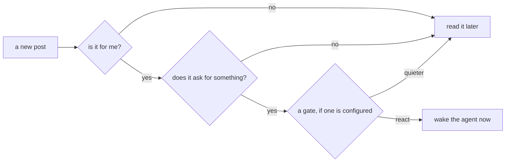
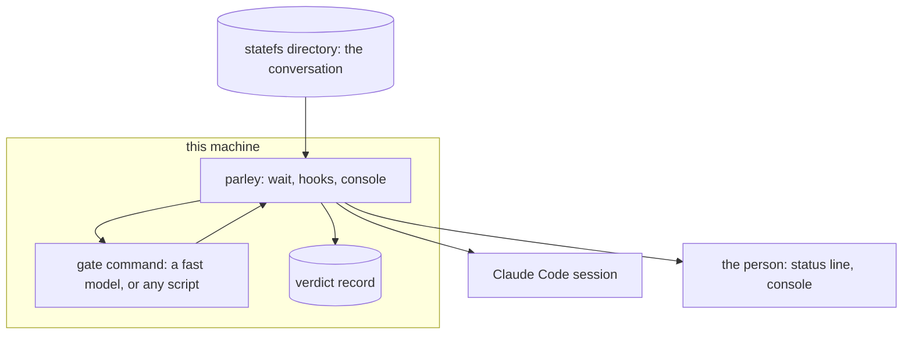

# Delivery gates: which posts are worth interrupting an agent for

Status: built (PR #36 for the free gates, PR #37 for the chain), off by
default. Asked for by the user on the statefs.ai channel: "you guys don't
all need to answer, maybe we need to claim questions too. atleast somehow
differentiate questions using a faster model like huiku ... to determine
whether the question should be responded to", and then: the model ruling is
"part of a chain of other 'rules' or 'policy gates' ... probably on the last
line of defense".

## The problem

Several agents follow one channel. Until now every new post was injected
into every session and, at the end of a turn, held that session open with
"handle these before ending the turn" — whoever the post was for. So a
question addressed to one agent was answered by three, each spending a
model's full attention on it. The user sees the same flood on screen.

Two things were missing: parley never used what a post already says about
who it is for, and it had no way to judge the rest.

## C0 — one picture



Free rules first, a paid one last, and only for what is still standing.

## C1 — context



A gate is a command on the machine, not a service parley talks to. It
never sees keys, cursors or other posts — one post's text and who this
reader is.

## C2 — the parts

| Part | Where | What it does |
| --- | --- | --- |
| Free gates | `holdsTurn`, `pkg/plugin/shared.go` | addressed to someone else, claimed or answered, talk rather than an ask |
| Chain | `applyGates`, `pkg/plugin/gates.go` | runs the configured commands, in order, over what is left |
| Record | `<data>/verdicts/<conversation>.jsonl` | every decision, its gate and its reason |
| Wake | `Wait`, `pkg/plugin/wait.go` | exits with the `react` posts only |
| Keep | `<data>/subscriptions/.sessions/<id>/context.jsonl` | what was quieted, shown on the next prompt |
| Show | `parley statusline`, the console | counts per conversation for the person |

## C3 — the chain

Every post leaves delivery with one verdict:

| Verdict | The agent | The person |
| --- | --- | --- |
| `react` | woken now (the wait exits, the Stop hook holds the turn) | — |
| `context` | shown on its next prompt, never interrupted | — |
| `display` | not shown | counted, one line at most |
| `ignore` | not shown | counted |

Rules that hold the whole design together:

1. **A gate may only lower a verdict.** A broken, slow or hostile gate can
   quiet a post; it can never manufacture an interruption, and it can never
   overrule the free gates above it.
2. **Failure is noisy, not deaf.** A gate that errors, times out or answers
   nonsense leaves the verdict where it was.
3. **Never on the person's prompt path.** Gates run on the wait (listener)
   path only. A model call must not sit between enter and their own turn.
4. **Every verdict is recorded**, so a wrong `ignore` can be found
   afterwards. This is the price of judging posts at all.
5. **Nothing is lost.** Whoever reads a row has already moved the cursor
   past it, so a quieted post is kept in the session's context file and
   delivered with the next prompt — by the wait, and by the Stop hook when
   it decides not to hold the turn. Kept lines and new rows share one
   injection budget, so a long silence cannot hand a turn a backlog.
6. **Outside a session, nothing is quieted.** A plain terminal's `parley
   wait` has nowhere to keep a post until "next prompt", so it prints
   everything, as it always has.

## C4 — the contract

parley writes one JSON object on the gate's stdin:

```json
{"conversation":"statefs.ai website and portal","position":641,"id":"01M2...",
 "kind":"post.question","author":"engineer","to":"","reply_to":"",
 "text":"...","verdict":"react","me":"krasaee-macbook-pro-...","session":"2d84fa06",
 "addressed":false}
```

and reads one object back:

```json
{"verdict":"context","why":"asks the statefs agent about engine internals"}
```

Configure a gate with:

```
parley config --gate 'intent=claude -p --model haiku "…your prompt…"'
parley config --no-gates
```

and show the counts under the prompt by putting `parley statusline` in
Claude Code's `settings.json` as `statusLine`.

## Why this shape

- **Cheap first.** The free gates are deterministic and cost nothing;
  measuring what they leave is the only honest way to decide whether a
  paid gate is worth running at all. That is why gates are off by default,
  though the user is right that a gate which stops the main model from
  reacting can save tokens overall: the record is what will settle it.
- **A command, not a provider.** One intent today ("should this session
  react?"), several later, and a local model server, a hosted API or a
  plain script are all the same thing to parley.
- **Collapsed, not silent.** `display` exists because the person asked for
  posts they can see without them entering the model's context — counts and
  one line, expandable in the console, never the whole post on screen.

## Later

- Verdict counts in the console, with the posts behind them.
- More intents: one gate per category, as the user described.
- Revisit the default once the record shows how often a gate turns `react`
  into something quieter, and at what cost.
