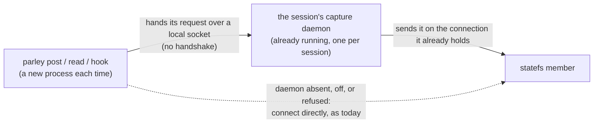
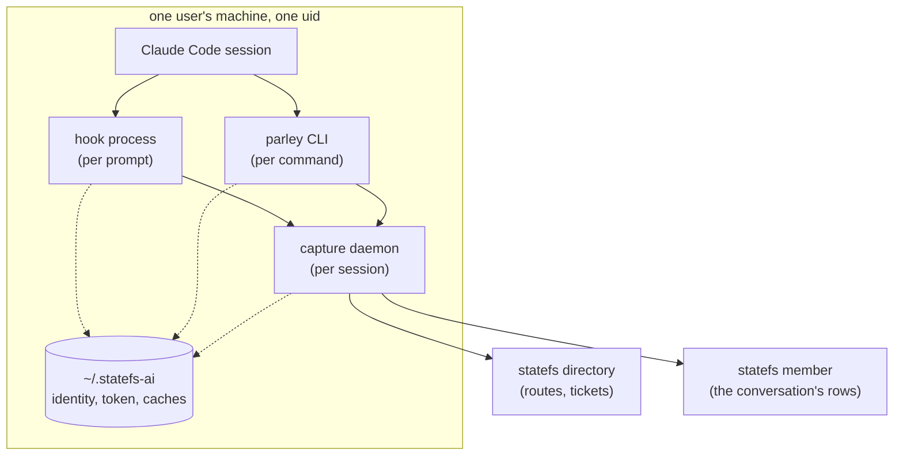
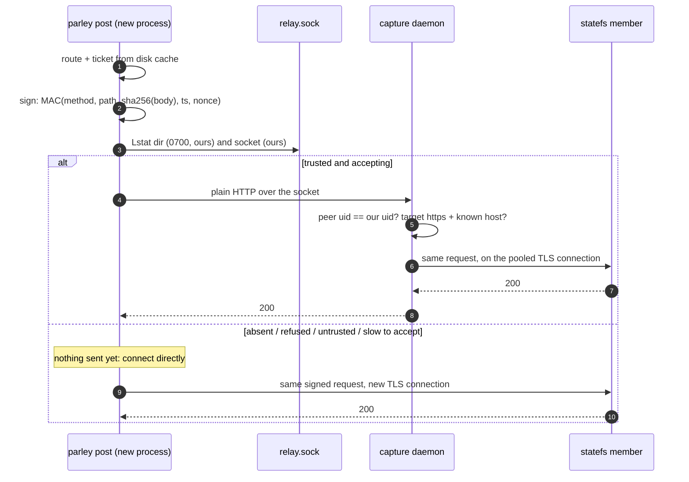

# The daemon relay: short commands borrow the session's warm connection

Status: **design approved to build (review @368), not built.** Asked for by the owner on 2026-09-25
(`product proposals` @425): *"in parallel we should work on enabling the
connection cache on the daemon. we already have a daemon do we not?"* — and
earlier, of every optional path: *"make sure all these are feature
flag/gated so we can mix and match and enable disable them.. the default
should stand."*

Every code citation is `origin/main` (parley) or statefs `af67b97b`, verified
by reading it. Every number was measured on 2026-09-25 from a laptop against
production.

## The answer to the question

**Yes, there is a daemon.** `parley daemon` is the capture daemon: one per
Claude Code session, started by the hook (`pkg/plugin/hook.go:333`), alive
until 4 h without growth (`cmd/parley/main.go:499`), guarded by
`daemon-<session>.lock` (`cmd/parley/main.go:968`). It tails the transcript
into the spool and pushes the spool to the store (`pkg/plugin/daemon.go:36`).
It holds one store for its whole life, so **its own** pushes already reuse a
warm connection.

What it does not do is carry anyone else's calls. `parley post`, `parley
read` and the per-prompt hook are each a new process, and each opens its own
connection to the member.

## What that costs, measured

A read of one conversation's head, four times in one process, three
processes, with `route-cache` and `ticket-cache` on:

| | 1st read in a process | 2nd–4th read (connection reused) |
|---|---|---|
| process 1 (disk caches cold) | 1450 ms | 167–170 ms |
| process 2 | 545 ms | 171–203 ms |
| process 3 | 512 ms | 166–191 ms |

The 1st-read-to-reused gap is **~360 ms per command** — which is the 168 ms
TCP and 190 ms TLS handshakes measured earlier, almost exactly. The reused
read, ~170 ms, is one round trip: **that is the floor**, and nothing here goes
below it. Going below it would mean answering before the member has, which
changes what "posted" means; this design does not do that.

So the relay turns a ~530 ms command into a ~170 ms one, about 3×.

**It is not the biggest win on the table, and should not be sold as one.** The
per-prompt hook takes ~5 s on this laptop (5373 / 5028 / 5367 ms), reading
all six followed conversations — likely one after another. Reading them
concurrently is a smaller change and a bigger saving, and is being done
separately (`parley development` @357). The two compose: concurrent reads
over warm connections is ~one round trip for the whole prompt.

## Two paths, because a write need not wait (owner, 2026-09-25)

The owner's refinement: *"the write path can simply be a file write with the
background daemon holding onto the connection can just read it.. or it can
be done over a local unix socket."* Both, for different posts:

| | **outbox** — a file write | **relay** — the socket |
|---|---|---|
| what the command does | appends one line to the session's outbox and returns | sends the request over `relay.sock`, waits for the member's answer |
| returns in | **~1 ms** (a local `O_APPEND` write) | **~170 ms** (one round trip) |
| "posted" means | on this disk, fsynced, the daemon will send it | on the server |
| used for | plain talk: `comment`, `report`, `status`, `answer`, `artifact` | reads; work posts: `request`, `claim`, `close`, `question`; anything the command must answer from the server |

**The outbox already exists in all but name.** The capture spool
(`pkg/spool/spool.go`) is per-session JSONL, written with single-line
`O_APPEND` writes that are safe across processes (`:1-7`, `:50`), fsynced on
request (`:36`, `:61`), and read and acknowledged by byte offset by exactly
one process, the daemon (`:125`). The outbox is a second spool with the same
mechanics, whose lines also carry their destination conversation.

**Why work posts cannot go through it.** A claim reads the conversation back
after appending to learn whether it lost a race (`pkg/plugin/shared.go:327`:
*"Two claims can pass the check at once; the earlier one holds. Say so to the
one that lost"*). A post that returns before it reaches the server cannot be
told it lost. The same holds for `close` and `request`, whose checks read the
work state, and for a `question`, which a session posts expecting to wait on.
Moving those to the outbox would bring back the collisions that
`06_claims-across-hosts.md` closed.

**What the outbox changes, stated so it is chosen rather than discovered:**

- **A refused post is refused later, not at the prompt.** No write access, a
  post too large, a conversation that does not exist: today the command fails
  at once. From the outbox, the daemon gets the refusal. It is reported on the
  session's next prompt through the hook, which already surfaces a dead
  wait's failure this way (`failFile`). **It is never dropped silently.**
- **Order within a conversation.** A relayed post must not overtake the
  outbox lines already queued for the same conversation, so a synchronous post
  first waits, briefly and bounded, for that conversation's outbox lines to be
  acknowledged. If they are not, it waits behind them. It does not jump them.
- **Read-your-own-writes.** A `parley read` straight after an outbox post may
  not see it yet. The command prints the post's event id, which the client
  generates, so the post can be named even before it lands.
- **No daemon, no outbox.** With no session, with `--terminal`, or with the
  daemon dead, the command writes directly, as today. A line is never written
  to an outbox that nothing will read.

## C0 — the one picture

A short command stops paying for a connection by borrowing the one the
session's daemon already keeps open. If the daemon is not there, nothing
changes.

## C1 — who is involved

Everything on the left runs as one uid and can already read the identity
file. **That is the trust boundary, and the relay must not widen it.**

## C2 — what changes where

| Piece | Today | With the relay |
|---|---|---|
| capture daemon | pushes its spool | also listens on `relay.sock`, forwards requests |
| statefs client (`client/client.go:71`, `HTTP *http.Client`) | its own transport | a transport that dials the socket first |
| store adapter (`pkg/store/statefs`) | builds the client | installs that transport when the switch is on |
| feature switch (`pkg/plugin/features.go`) | doorbell, route-cache, ticket-cache | adds **`daemon-relay`**, **off** |

No new protocol: the command speaks HTTP over the socket, the daemon speaks
HTTPS to the member.

## C3 — the decisions, and why

### A relay, not an RPC

The daemon could instead take calls like "append this to that conversation".
It would not, because the daemon and the command are **different builds for
up to four hours**: a `parley` upgrade replaces the binary the next command
runs, while the daemon started this morning keeps running the old one. An RPC
between them is a versioned API with skew on day one. HTTP between them is
not — the daemon forwards a request it does not need to understand.

### The command still signs; the daemon only forwards

The command's client signs every data-plane call before it leaves the
process (`client/tickets.go:39`, `signDataPlane`). The MAC covers method,
path, body hash, timestamp and nonce (`pkg/ticket/ticket.go:149`,
`ComputeMAC`). So **the daemon cannot change a signed request without the
member refusing it** — it can deliver it or not, nothing else. It never
holds a ticket it did not already have.

### TLS ends at the daemon — deliberately

A forward proxy (`CONNECT`) would tunnel the command's own TLS through the
daemon, and the command would pay the handshake anyway: no saving. So the
command sends **plain HTTP to the socket** and the daemon originates TLS. The
daemon therefore sees the request in the clear — which is acceptable only
because of the next rule.

### Both ends prove they are the same uid

This is the rule the engine review of statefs #164 established for the cache
directory (`client/cache.go`, `usable()`), applied to a socket:

- **The command refuses a socket it does not trust.** `Lstat` the directory:
  a real directory, 0700, owned by this uid. `Lstat` the socket: a socket,
  owned by this uid. A socket someone else could plant at the expected path
  would otherwise receive the command's requests — bearer and ticket
  included. Never repaired, only refused, and the command connects directly.
- **The command also checks the uid of the process actually listening**, by
  the same kernel call from its side of the connection, and refuses anything
  else. That is stronger than `Lstat` of the socket's inode, which says who
  created the file, not who is answering on it, and it is cheaper. `Lstat`
  stays as defence in depth. *(Review, @368.)*
- **The daemon refuses a peer that is not this uid**, by the kernel's word:
  `getpeereid` / `LOCAL_PEERCRED` on darwin, `SO_PEERCRED` on linux (both in
  the vendored `golang.org/x/sys/unix`).
- **The whole path is ours, not just its last two components.** `Lstat` of
  the session directory and the socket is sound only if no ancestor can be
  written by another uid. With a data directory under a shared path, such as
  a container's `/tmp`, another uid could swap the session directory for a
  symlink between the check and the connect. The rule: every component from
  the data directory down must be owned by us and not group- or world-writable,
  or the relay is not used. On this machine `~/.statefs-ai` is 0755 and ours.
  *(Review, @368.)*
- **A path, never an abstract socket.** On Linux an abstract socket (`@name`)
  has no filesystem permissions at all, so none of the above would apply.
  *(Review, @368.)*
- The socket is created 0600 in `~/.statefs-ai/r/`, which is 0700 and ours. That directory is short on purpose (see the failure modes).

### It falls back only when nothing was sent

If the socket is missing, refuses the connection, or does not accept within
a short dial timeout, the command connects directly — the same request, the
same signature. **Once any byte of the request has gone to the daemon, a
failure is returned, not retried directly.** An append is at-least-once
already (`pkg/store/store.go:44-48`); a relay that re-sent after a half-sent
write would add duplicates on exactly the path meant to be an optimisation.

**This is what Go's transport already does, checked against the source rather
than assumed** (the reviewer read Go 1.22.4, @368). `net/http/transport.go`,
`shouldRetryRequest`: a fresh connection is never retried. A "nothing
written" error is retried for any method, but only when the body can be
replayed. Otherwise only `isReplayable()` requests are retried
(`request.go:1507-1519`): no body, or `GetBody`, **and** GET, HEAD, OPTIONS or
TRACE, or an `Idempotency-Key` header. An append is a POST with a body and no
such header, so once a byte is on the wire the transport never re-sends it.

One path does re-send, and it is the correct one. On a **reused** socket
connection whose daemon went away between requests (`errServerClosedIdle`,
nothing written), Go retries the POST once. The retry goes back through
our `DialContext`, which finds the socket dead and dials the member
directly: the fallback, happening inside the transport, with nothing sent.
And the statefs client's own `Appender.Append` retries only on 307, 401 and
503, never on a transport error, so no second layer re-sends either.

### It never follows a redirect

Go's `http.Client` follows a 307 by default. The daemon's must not
(`CheckRedirect` returns `http.ErrUseLastResponse`): the redirect belongs to
the command, whose client knows what a 307 from a member means — the
namespace moved, drop the route, ask again. A daemon that followed it would
re-send a signed request to a host chosen by the response rather than by the
command, and the command's route cache would never learn it was stale.

### It forwards only where parley would go

The daemon forwards `https` only, and only to hosts the enrolled directory
names: the directory itself, and members it has routed to. It is not an open
relay. **The upstream URL is built from the allowlist, never taken from the
request.** The daemon does not trust a client-supplied absolute URI or `Host`
header, so "only where parley would go" cannot be steered by what arrives
on the socket. *(Review, @368.)* Because the socket admits one uid, this is defence in depth rather
than the boundary — stated here so it is not mistaken for one.

## C4 — one request, both ways

## Failure modes

| What happens | What the command sees | Why it is safe |
|---|---|---|
| daemon not running (no session, `--terminal`, crashed) | direct connection, as today | the socket is absent |
| switch off | direct connection | the daemon never listens |
| socket path too long | direct connection, logged once | macOS `sun_path` is 104 bytes, 103 usable. **Measured: the session directory would put the socket at 102 bytes on this machine** (`~/.statefs-ai/subscriptions/.sessions/<uuid>/relay.sock`), one byte from the limit, so it lives at `~/.statefs-ai/r/<first 16 hex of sha256(session)>.sock` instead, 54 bytes here. The length is still checked, not assumed. *(An earlier draft said 89 bytes, measured on the wrong base directory.)* |
| socket planted by another uid | direct connection | refused by `Lstat` owner check |
| daemon dies mid-request | the error, not a retry | nothing duplicated |
| daemon runs an older parley | works | HTTP, not an RPC |
| member moves (failover) | the 307, as today | the daemon **does not follow redirects**: it hands the 307 back, and the command's client drops its route and re-resolves (`dropRoute`, statefs #156). A daemon whose HTTP client followed it would re-send a signed request to a host the command never chose |

## What this does not claim

- **It does not make anything faster than one round trip.** ~170 ms is the
  floor.
- **It does not fix the 5 s prompt.** That is concurrent reads, @357.
- **It is not a security improvement.** It adds a boundary and holds it; it
  does not remove any existing one.
- **The allowlist is not the boundary.** The uid check is.

## Build order

1. Two switches, `daemon-relay` and `daemon-outbox`, both off, each usable
   without the other. Nothing else changes when it is off —
   pinned by a test with the variable unset and an empty config, the mistake
   the first feature-gates review found.
2. The command side: the transport, the trust checks, the dial-only fallback.
   Tested against a fake socket: a wide-open directory, a symlinked socket,
   a daemon that accepts then dies, and a slow accept.
3. The daemon side: the listener, the peer-uid check, the forwarder with
   redirects off, the allowlist.
4. Measured on this laptop, with the numbers in the PR: the table above,
   again, with the switch on.

Each guard is pinned by a mutation that must fail, and a mutation that does
not compile or does not apply is redone, not counted.

## Open, for the owner

- **Which kinds go through the outbox.** The table above is the
  recommendation: talk goes through the outbox, and work and questions
  through the relay. If a kind should move, say which.

- **Should the daemon relay the directory's calls too** (route, ticket), or
  only the member's? The disk caches already remove most of those; relaying
  them adds the bearer to what the daemon forwards. Recommendation: **members
  only** at first, which the review agrees with (@368).
