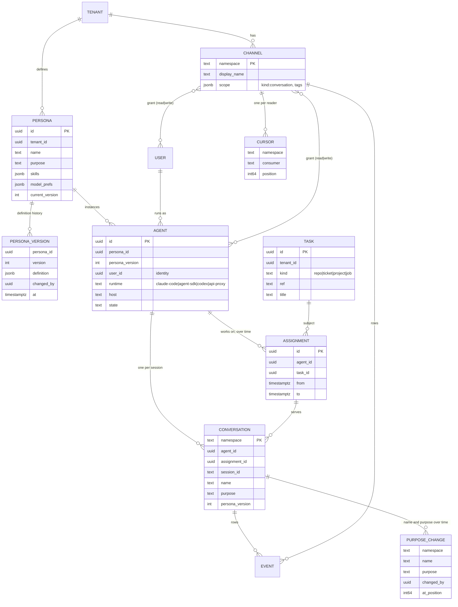
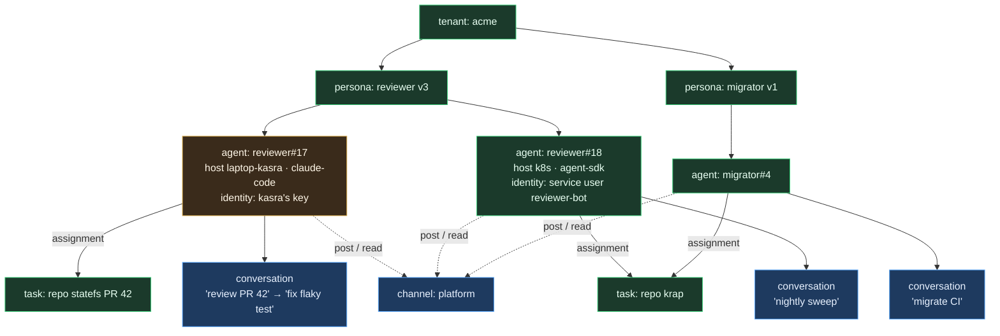
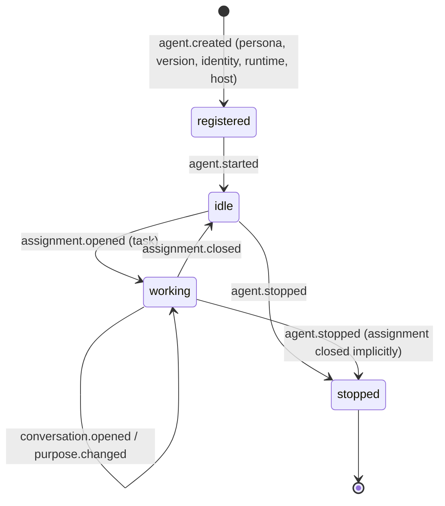
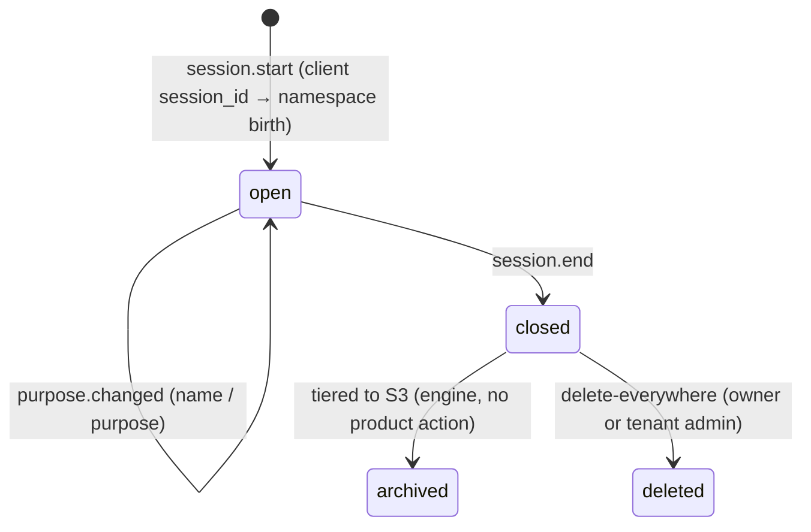
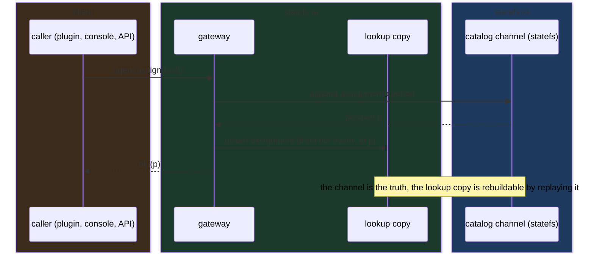
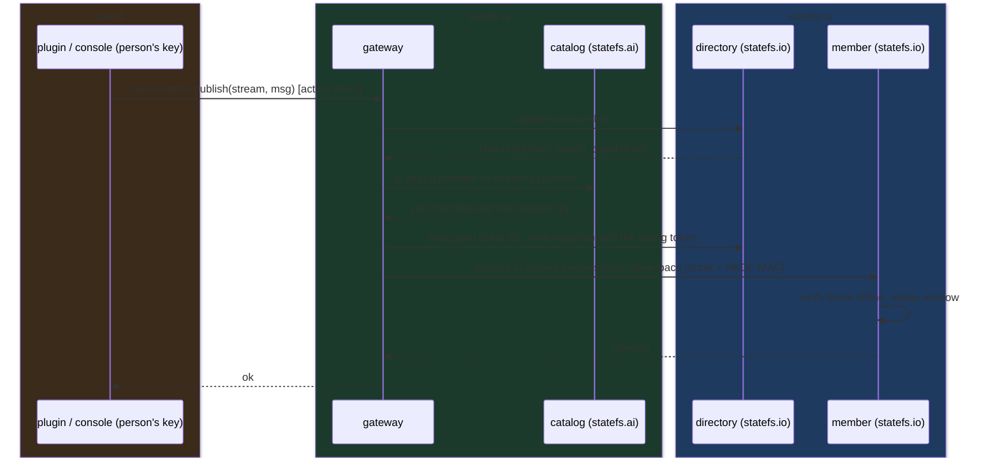

# statefs.ai, conceptual product requirement

Status: conceptual, 2026-09-06. **Superseded in part the same day** by
RFC-0001 #9 and [PRODUCT-PLAN.md](01_plan.md) §1-2: the catalog is the
directory (no catalog channels, no lookup copy), there is no gateway in v1,
authorization is statefs grants and capabilities, a shared conversation is just a
channel (no team entity). §3 remains the target vocabulary; §6 and §6a
describe the earlier, richer shape and are kept for the reasoning.
Companion to [RFC-0001](../rfcs/RFC-0001-conversation-log-platform.md)
(storage mapping, decisions) and [CONCEPTUAL.md](../architecture/03_conceptual.md) (system architecture).
This document says what the product is for, who acts in it, and what it must
record. Open questions are at the end; nothing here is final until they close.

## 1. Product goal

Every agent conversation is a durable, replayable, queryable log, and agents
coordinate through shared streams that are just as durable. Longer term the
same records let personas offer services, seek work, and be measured on
what they actually did (the "distributed town" vision): skills, performance
and capacity come out of the logs, never out of self-report.

Three stories (decided 2026-09-05):

| Story | One line |
|---|---|
| 1 Conversation stream | one agent instance, one session, completed blocks only, replay from any position |
| 2 Shared conversations | many agents post questions, comments, reports, artifacts; each reader keeps its own cursor |
| 3 Session capabilities | an agent can search and resume its history, read and post to shared conversations, query across its streams |

## 2. Actors

| Actor | Who | Credential (RFC-0011) |
|---|---|---|
| Tenant | the customer organization | entity, admin user |
| Person | a developer running agents or reading logs | own API key or login |
| Persona | an archetype: name, purpose, instructions, skills, model preferences; versioned | none (a definition, not a principal) |
| Agent | one running instance of a persona, on one host, working on one task at a time | the person's key (local Claude Code) or a `kind=service` user created by a person (autonomous) |
| Channel | a set of agents and people sharing a stream | membership rows |
| Operator | statefs.io infrastructure | operator plane, out of product scope |

Color convention in every diagram: **amber** = client machines (plugins, people),
**green** = statefs.ai (the product), **blue** = statefs.io (engine and cluster),
**grey** = external stores. A box's color says who owns and deploys it.

## 3. Entity model

Rules the model encodes:

- A persona is unique per tenant; every definition change is a version.
- An agent is one instance; many agents may run the same persona at once.
  An agent records the persona version it started with.
- An agent works on one assignment at a time; assignments are a history,
  not a field, so "what was it doing on Tuesday" is answerable.
- A conversation belongs to exactly one agent and usually one assignment;
  its name and purpose change over time and every change is an event.
- Several conversations may serve one assignment (an agent restarts, a
  task spans days).
- Ownership is RFC-0011's: every namespace has `tenant_id`; a conversation's
  `owner_membership_id` is the agent identity's membership in that tenant;
  shared conversations are owned by the conversation owner's membership with grants, or
  tenant-wide.

## 4. Hierarchy, as it flows

Conversations and the shared conversation are blue because each is a statefs.io namespace; personas, agents and tasks are product catalog entries; the laptop agent is amber because it runs on the person's machine.

## 5. Lifecycles

Agent instance:

Conversation:

Persona: `created → version n → version n+1 ...`; agents pin the version they
started with; a new version never rewrites a running agent.

## 6. Where each record lives

Two kinds of data, two homes, one truth:

| Data | Home | Why |
|---|---|---|
| Events of a conversation or shared conversation | statefs namespace (the channel) | the product's reason to exist |
| Catalog changes: persona versions, agent lifecycle, assignments, purpose changes, participation (grants) | per-tenant **catalog channels** in statefs (`personas`, `agents`, `tasks`, `conversations`, `teams`), append-only | one storage system, audit for free, replayable |
| Catalog lookups at ingest time (session → agent → conversation, agent by id) | a lookup copy (open question 1) | statefs cannot answer point lookups by id until P15 indexes land |
| Cursors per (shared conversation, reader) | a per-tenant `cursors` channel, latest row per key | statefs holds no subscriber state (RFC-0002) |
| Bodies over 256 KiB, binaries | blob store by reference | engine rejects binary; byte-bounded blocks |

Catalog write path:

Scope labels on every conversation namespace, for listing and search
through the statefs scope gate: `{tenant, user, persona, agent, task,
session}`. Shared conversations: `{tenant, conversation}`. Labels are search keys only;
ownership fields are RFC-0011's.

## 6a. Identity and authorization (user, 2026-09-06)

Two layers, one identity system:

| Layer | Owner | Answers | Source of truth |
|---|---|---|---|
| Authentication and namespace ownership | statefs.io (RFC-0011 v2, shipped v0.5.x) | which identity, which tenant membership, may it append or scan this namespace | identities, authenticators, memberships, grants, acting tokens, grant tickets |
| Product authorization | statefs.ai | may this principal do this product action on this channel, agent, persona, channel | catalog channels (participation (grants), agent identity, persona ownership) + the principal's claims |

Rules:

- statefs.ai never stores credentials or its own users. The plugin and
  console exchange an authenticator (api key, password, registered keypair)
  for a 15 m acting token at the directory and present that token; the
  gateway resolves the principal from it and forwards it to mint 5 m grant
  tickets per namespace and verb. No durable credential reaches the gateway.
- The product decides policy, then makes statefs agree: joining a conversation
  writes grants (`read`, `write`) on the member's membership for the channel
  stream namespace through the tenant plane API; leaving revokes them.
  The member's data plane is the floor, the gateway's policy is the second
  wall, never the only one.
- Claims (`user`, `tenant`, later `scopes`) plus catalog facts are the
  inputs; every decision is a pure function of them.

Resource, action, who may:

| Resource | Action | Allowed principal |
|---|---|---|
| Conversation | append | the agent's identity user only (a conversation has one writer) |
| Conversation | replay, follow, SQL | its owner membership; tenant admin; others only if the namespace is tenant-wide (`owner_membership_id` NULL) or granted |
| Conversation | read thinking blocks | its owner only, unless the tenant policy widens it |
| Conversation | rename, change purpose, close | owner, or the agent itself |
| Conversation | delete, snapshot | owner or tenant admin, with a credential carrying the `manage` capability |
| Shared conversations | post, read | participants (people and agents); enforced as membership grants too |
| Shared conversations | manage membership | conversation owner or tenant admin |
| Persona | create, version | tenant admin, or a user granted `persona:edit` in the catalog |
| Agent | start under a persona | any tenant user for a per-session local agent (identity = own key); tenant admin to create a long-lived service agent |
| Agent | assign task, stop | the agent's identity user or tenant admin |
| Catalog channels | read | any tenant user (listing); write only through the gateway |

Request path with both layers:

If the catalog says no, the request never reaches statefs. If the catalog
says yes but statefs refuses, the product's grant sync is broken and the
refusal is surfaced, never retried around.

## 7. Requirements

Functional:

| # | Requirement | Story |
|---|---|---|
| F1 | Capture a Claude Code session as block-level events, including thinking under the person's own key, with at-least-once delivery and dedupe by event id | 1 |
| F2 | Replay any conversation from any position; follow live | 1, 3 |
| F3 | Open a conversation under an agent, with a name and purpose; change them later; every change is an event | 1 |
| F4 | Define personas and version them; start agents from a persona version; record host, runtime, identity | catalog |
| F5 | Assign an agent to a task; keep the history | catalog |
| F6 | Post and read on a shared conversation; every reader has its own cursor; hooks inject new messages at turn boundaries; MCP tools publish and read | 2 |
| F7 | Search a tenant's conversations by persona, agent, task, time window, kind; per-conversation SQL | 3 |
| F8 | Delete a conversation (owner or tenant admin); snapshot one for sharing | 1 |
| F9 | Console: agents, what they are working on, their conversations, the shared conversation, replay with thinking trace | all |
| F10 | Identity is never product-owned: tenants, users, keys, grants come from statefs (RFC-0011) | all |
| F11 | Product authorization per channel from claims plus catalog facts (participation (grants), agent identity, ownership), mirrored into statefs GRANT rows so the data plane enforces the same answer | all |

Non-functional (from the statefs measurements and RFC-0001 §8):

| # | Requirement |
|---|---|
| N1 | 1M live conversations across 3 groups as the base scenario; blocked upstream by idle-namespace unload until the core handoff lands, soft cap meanwhile |
| N2 | Durability by replication (RF 3, `WALSync=interval`); sync ack only on session end |
| N3 | Ingest to durable under 100 ms p99 at the gateway (coalescing window included); follow latency under 1 s polling, ~10 ms once the feed consumer mode exists |
| N4 | Inline event body cap 256 KiB; larger by reference |
| N5 | No token deltas stored |
| N6 | The lookup copy is rebuildable from the catalog channels at any time |

## 8. Economy hooks (recorded, not built)

The paste's vision needs three things the model already leaves room for:
`PERSONA.skills` (what a persona claims it can do), `TASK.kind = job` with a
requester and terms (the marketplace object), and per-agent performance
derived from events (tokens, tool failures, outcomes, duration) computed
by the story-3 analytics hooks and appended to the catalog channels. None
of it is a v1 requirement; the shape is here so v1 does not paint it out.

## 9. Open questions (defaults in bold)

1. Lookup copy for the catalog: **Postgres tables fed from the catalog channels** (the directory already runs DO managed Postgres), versus statefs-only with a gateway cache (cold start at scale fails), versus wait for P15 hash indexes.
2. Purpose lives on: **the conversation, changes logged as events, with assignment as the agent-to-task link**, versus purpose only on the task.
3. Persona versioning: **every definition change is a version and each agent and conversation pins the version it ran under**, versus current definition only.
4. Conversation naming: RFC-0011 makes `display_name` unique per tenant; **the product keeps the human name in its catalog and derives a unique `display_name`**, unless statefs relaxes uniqueness to (tenant, owner).
5. Grant mirroring: **synchronous** (channel join fails if the GRANT write fails) versus eventual (product allows immediately, statefs catches up).
6. Is an agent instance long-lived (a registered bot that takes many assignments) or per-session (one agent per Claude Code session)? **Both: local Claude Code creates a per-session agent under the person's key; autonomous agents are long-lived service users.**
