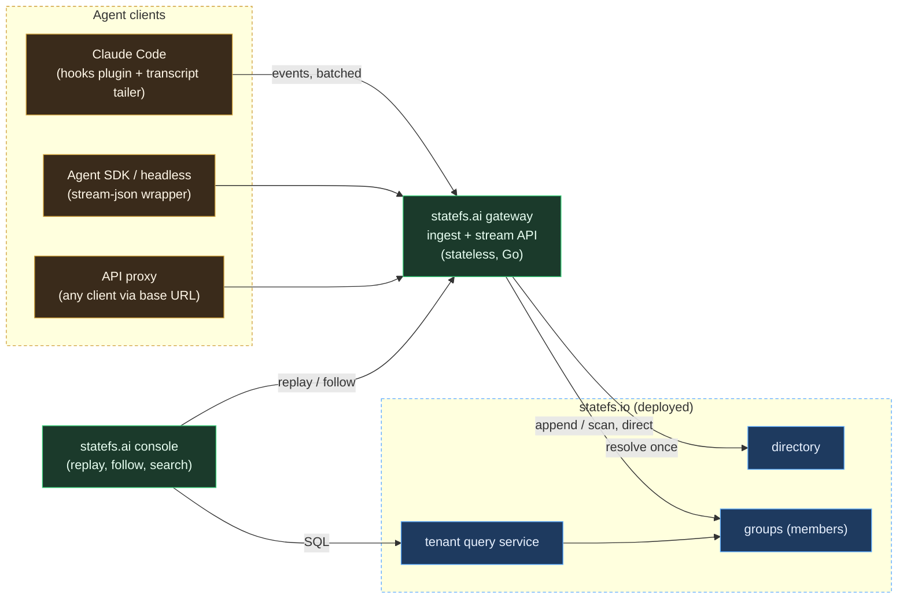
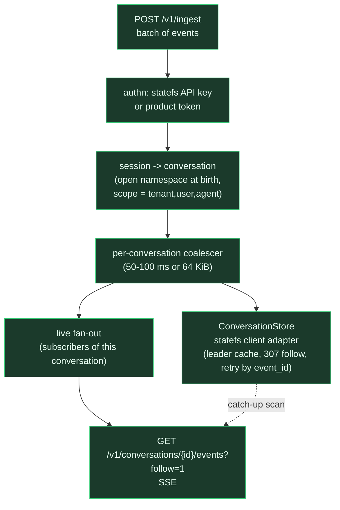

# RFC-0001: statefs.ai, an agent conversation log platform on statefs.io

- **Status:** v1 scope DECIDED 2026-09-06 (user answered the §11 questions); building from S0. Draft 2026-09-04, revised 2026-09-05 (three stories, shared conversation). Decision pending (user review). Companion:
  [STATEFS-CAPABILITIES.md](../reference/01_statefs-capabilities.md) (what the engine gives us and where it falls short).
- **Diagrams:** [CONCEPTUAL.md](../architecture/03_conceptual.md) (C1-C3, channel types, flows per story).
- **Naming:** statefs.io is the storage engine and cluster (`../statefs`).
  statefs.ai is one product on top of it: this repo (renamed from `fabric.ai` 2026-09-06).

## 1. Problem

Hundreds of thousands to millions of agent conversations run at once. Each
one is an unbounded append log: user messages, assistant text, thinking,
tool calls and results, subagent activity. They come from heterogeneous
clients (Claude Code, the Agent SDK, other CLIs, raw API traffic). Every
stream must be captured with its reasoning trace, stored durably, replayable
from any position, followable live, and queryable, without standing up a
database per conversation.

One line: **a channel is a statefs namespace; an event is a row.**

### 1.1 The three stories (user, 2026-09-05)

| Story | What it is | Writers | Readers | Tracked cursors |
|---|---|---|---|---|
| 1. Conversation stream | the session's own log: completed blocks only, never token deltas | one session | replay, follow, query | none (readers are ad hoc) |
| 2. Shared conversations | a shared side channel: questions, comments, reports, artifacts posted by hooks or wrappers on a cadence set by a skill or CLAUDE.md; durable and indexed | many sessions | every member session, on its own cursor | yes, one per (stream, consumer) |
| 3. Session capabilities | what a session can do with 1 and 2: search and resume its history, read and ask the channel, query across streams | | | |

Settled 2026-09-06 (user): **every content stream is a conversation**. An
agent's own log is a conversation with one participant; a shared stream is
a conversation with many. Access is identity-scoped through grants, so the
only difference between the two is who holds a grant. Under the product
noun, a conversation is one statefs namespace (a "channel" in RFC-0002
terms). No "team" or "channel" entity exists in the product model.

## 2. The mapping

| Product concept | statefs.io primitive | Notes |
|---|---|---|
| Conversation | namespace (UUID, scoped) | born once via directory resolve; pinned to a group forever |
| Event | record (row) | schemaless map; JSON columns for `content` |
| Event ordinal | row position | replay cursor, permanent |
| Tenant / user / agent | namespace `scope` claims | listing and auth ride P12 scoping |
| Replay | `Scan(ns, from, to)` | pages through blocks + tail in order |
| Follow live | ReplicaFeed `Subscribe` (gRPC push, ~10 ms) | built for replicas: in-cluster port 9001, subscriber enters the marks board and holds WAL retention; consumer mode is parked (gap 3) |
| Per-conversation analytics | tenant query service (DuckDB) | one query = one namespace |
| Cross-conversation analytics | product index namespaces | one row per conversation event of interest |
| Archive | S3 tier via compaction | free with the engine |
| Share / freeze | `Snapshot` | copy-to-prefix, immutable |
| Delete | delete-everywhere | directory fanout + unpin |

## 3. Client/server or embed

Both are legitimate because statefs is library-first (`node.New` in-process)
and also deployed as a service at statefs.io. Traced consequences:

| Concern | A: gateway is a statefs client | B: gateway embeds `node.Node` (is a member) |
|---|---|---|
| Hop on the write path | gateway -> owning member (HTTP JSON, batched per conversation) | none if the request already landed on the owning gateway; otherwise gateway -> owning gateway (the hop moves, it does not vanish, because one leader owns each namespace) |
| Gateway shape | stateless Deployment; scale by CPU | StatefulSet with PVC, lease, replication; scale by storage |
| Release coupling | product and engine ship independently | product release = engine release |
| Live follow | gateway subscribes to the feed as a consumer (in-cluster gRPC) and fans out to its SSE clients | in-process view of the tail; still needs cross-pod fan-out |
| Failure domain | product bug cannot corrupt storage | product bug runs inside the storage process |
| Reuse of statefs.io as deployed | full: directory, auth, query service, consoles, drills | partial: must register gateways as groups; existing groups become dead weight |
| Cost to switch later | swap the adapter behind the store port | swap the adapter behind the store port |

Recommendation: **A for v1**, behind one port in the gateway:

```go
type ConversationStore interface {
    Open(ctx, scope) (ConversationID, error)            // namespace birth
    Append(ctx, id, batch []Event, opts) (Position, error)
    Scan(ctx, id, from, to) (iter.Seq[Event], error)
    Head(ctx, id) (Position, error)
}
```

The statefs client adapter is the only v1 implementation. An embedded
adapter is a later measurement-driven choice, not a design fork. The two
things embedding would buy (no hop, in-process tail) are cheaper to get as
statefs.io seams: per-conversation batching removes most of the hop cost,
and a long-poll on the member read endpoint gives tail-notify to every
client, not only to us.

## 4. Architecture

Color convention in every diagram: **amber** = client machines (plugins, people),
**green** = statefs.ai (the product), **blue** = statefs.io (engine and cluster),
**grey** = external stores. A box's color says who owns and deploys it.

C1, system context:



C2, the gateway:



## 5. Data model

One event per completed block, never per token delta. Claude Code's
transcript already yields block-level content (thinking, text, tool_use,
tool_result), so no delta reassembly is needed there.

| Field | Type | Meaning |
|---|---|---|
| `event_id` | ULID | client-assigned; dedupe key (gap 2) |
| `seq` | int64 | client-monotonic per session |
| `ts` | RFC3339 | client time |
| `ingested_at` | RFC3339 | gateway time |
| `session_id` | string | client session (Claude Code `session_id`) |
| `source` | enum | `claude-code`, `agent-sdk`, `codex`, `api-proxy` |
| `kind` | enum | `session.start`, `user.message`, `assistant.text`, `assistant.thinking`, `tool.use`, `tool.result`, `subagent.start`, `subagent.stop`, `session.end`, `meta` |
| `role` | enum | `user`, `assistant`, `system`, `tool` |
| `content` | JSON | kind-specific body (text, tool input/output, thinking) |
| `parent_event_id` | ULID | tool.result -> tool.use, subagent -> parent |
| `agent_id`, `agent_type` | string | subagent attribution |
| `model`, `tokens_in`, `tokens_out` | | cost and attribution |
| `blob_ref` | string | pointer when a body exceeds the inline cap |

Rules: inline body cap 256 KiB (gap 5), larger bodies go to blob storage by
reference (binary is rejected by the engine, gap 6); `content` is a JSON
column so DuckDB can `json_extract` it.

Index namespaces (product-owned, per tenant): `conversations` receives one
row on `session.start`, `session.end`, and on summary updates. This is how
"my conversations this week" is answered inside the one-namespace query rule.

## 5a. Shared conversations (story 2)

**Storage.** One namespace per shared conversation, scoped `{tenant, conversation}`. Many
sessions append to it; the owning leader serializes appends, so positions
are the channel's total order and no product-side ordering is needed. Writer
identity travels in the row (`session_id`, `agent_id`, `identity`, `participant`), which is
RFC-0007's "position = order, writer identity = intent" split. Throughput is
bounded by one leader, which is fine for coordination traffic; a busy
organization gets many shared conversations, not a faster one.

**Message shape.** Same envelope as §5 with `kind` in `post.question`,
`post.answer`, `post.comment`, `post.report`, `post.artifact` (blob ref),
`post.status`, `post.claim` (I am taking this task), plus `to` (agent id
or broadcast), `thread` (root event id), `reply_to`, and `tags`. Queries
such as "unanswered questions addressed to me since my cursor" are DuckDB
over the namespace, or over the per-tenant index namespace for cross-channel.

**Cursors.** Each consumer (a session, a bot, a console) owns an offset.
The gateway keeps the `(stream, consumer) -> position` registry; statefs
holds no subscriber state (RFC-0002 boundary). Delivery is at-least-once
from the feed or from a scan, dedupe by `event_id`. Broadcast semantics
only in v1; competing consumer groups are a later add-on.

**Publish and consume from Claude Code.** Three seams, all verified in the
hooks reference:

- publish: the capture plugin exposes a `channel` command (or an MCP tool set:
  `conversation.publish`, `conversation.ask`, `conversation.read`, `conversation.search`); a skill or
  CLAUDE.md tells the agent when to use it (on blockers, at `Stop`, on a
  report cadence). A `Stop` hook can also publish a status automatically.
- consume: a `SessionStart` or `UserPromptSubmit` hook reads the stream
  from the session's cursor and returns the new messages as additional
  context, so the agent sees shared-conversation traffic at every turn boundary without
  polling. Long-running turns can poll through the MCP tool.
- reply: `post.answer` with `reply_to`, which closes the thread for the
  asker's next read.

**Discovery and subscriptions (user, 2026-09-06).** A shared conversation
carries a description (`scope.description`, `scope.tags`, a `meta.purpose`
history). An agent finds conversations it may read through the directory
under its own acting token, which already returns only owned, granted or
tenant-wide namespaces. It subscribes by appending `agent.subscribed
{conversation, mode}` to its own agent namespace, unsubscribes the same way,
and the library enforces a cap (default 20). Mode `full` injects every new
post at turn boundaries; `digest` injects only reports, status and
summaries. A per-turn budget across subscriptions keeps context bounded.

**Summaries by participants (user, 2026-09-06).** No product process
calls a model. A summary is requested with a `post.request` row
(`{task: summarize, range: [from, to]}`), posted either by a local rule in
the library when a reader's turn begins and the conversation has more
than N unsummarized rows with no open request, or later by a job runner
for tenant-level policies. Any participant may answer it. A `post.claim` reply is advisory, a
signal of intent that lets agents avoid duplicate work when they want to,
not a lock: several agents may summarize the same range and every result
is kept as a perspective, attributed to its `identity` and the persona that
produced it (user, 2026-09-06: "different perspectives of the agents'
persona"). Each summary is a `meta.summary` row with `reply_to` the request, `content.summary_of = [from, to]`, and
the top-level `indexable: true` flag so a P15 bitmap can select summaries
without touching the rest. Digest-mode readers receive summaries in place of the section; when a
range has several, the subscription's `digest_pick` chooses: `all`
(default), `first`, or a persona name. Summaries chain: a request may cover a range of
summaries.

Retention is not ack-floor driven here: the stream is kept forever and
tiers to S3 like any namespace; cursors only say where each reader is.

## 5b. Session capabilities (story 3)

An MCP server backed by the gateway, installed with the capture plugin:

| Tool | Backed by |
|---|---|
| `history.search(query, since)` | tenant query service over the session's own conversations, or the index namespace |
| `history.replay(conversation, from, to)` | scan |
| `history.resume(conversation)` | scan the tail into context at `SessionStart` |
| `conversation.publish` / `conversation.ask` / `conversation.read` / `conversation.search` | §5a |
| `conversation.follow(id)` | feed subscription through the gateway |

Skills package the usage patterns (report cadence, how to ask, how to
resume) so the behavior lives in a `SKILL.md`, not in the tool server.

## 6. Capture adapters

### 6.1 Claude Code (the extension the user asked about)

Claude Code exposes two complementary surfaces, both verified 2026-09-04:

- **Hooks** (settings.json or a plugin `hooks.json`): `SessionStart`,
  `UserPromptSubmit`, `PreToolUse`, `PostToolUse`, `PostToolUseFailure`,
  `SubagentStart`, `SubagentStop`, `Stop`, `PreCompact`, `SessionEnd`, and
  more. Every hook receives `session_id`, `transcript_path`, `cwd`,
  `hook_event_name` on stdin; tool hooks add `tool_name`, `tool_input`,
  `tool_use_id`, and `tool_output`. Hooks give real-time lifecycle and tool
  I/O with exact timing.
- **Transcript JSONL** at `transcript_path` (`~/.claude/projects/<slug>/<session>.jsonl`):
  assistant messages with `thinking`, `text`, and `tool_use` blocks, user
  messages with `tool_result` blocks, `cwd`, `gitBranch`, `version`. A local
  session file inspected today held 517 thinking blocks, 740 tool_use, 735
  tool_result. The transcript is written asynchronously and can lag the
  current turn.

Adapter design: one small binary installed as a Claude Code plugin. Hooks
invoke it per event; a `SessionStart` hook also starts a tailer on
`transcript_path` that emits `assistant.thinking` and `assistant.text`
blocks by `uuid` (its own dedupe), and `SessionEnd` stops it. Everything is
spooled to a local append-only file first, then shipped in batches over
HTTPS; delivery is at-least-once, dedupe by `event_id`.

### 6.2 Agent SDK and headless runs

`claude -p --output-format stream-json` and the Agent SDK message iterator
already emit block-level events; a thin wrapper maps them to the schema.

### 6.3 Other clients

Codex CLI writes session JSONL under `~/.codex/sessions` (same tailer
pattern). Anything that accepts a base URL goes through an
Anthropic/OpenAI-compatible proxy that records the SSE stream. Editor
integrations come later.

### 6.4 Privacy

Thinking capture is a per-key setting, default on for the user's own keys.
The adapter has a redaction hook point before spooling. Deleting a
conversation is delete-everywhere on the namespace.

## 7. Durability posture (decided, user 2026-09-04)

Members run `WALSync=interval` (fsync at most once per second). Durability
comes from replication and horizontal placement, not from fsync per event:
these logs may be 99.9999999999% accurate rather than 100%, page-cache
flushes are acceptable, and hosts have battery backing. RFC-0005 keeps the
two dials separate anyway: fsync is each node's WAL mode, a sync ack is
replica contenantation. Defaults: RF 3, async ack for ordinary events, sync
ack (`X-Durability: sync`) only on `session.end` or on explicit client
request. Fsync-per-event stays available as a per-namespace floor for a
tenant that asks for it; it is not the product default.

## 8. Capacity model

Assumptions for the base scenario; scale linearly by adding groups, since
placement is a function of the namespace and volumes scale horizontally.

| Input | Base | Note |
|---|---|---|
| Concurrent conversations | 1,000,000 | namespaces alive on the cluster |
| Active fraction emitting | 20% | 200k emitting streams |
| Events per active stream | 0.2 /s | block-level, not tokens |
| Average event size | 2 KiB | tool outputs dominate |

Derived: 40k events/s, ~80 MB/s logical, ~7 TB/day before Parquet
compression (expect 3-6x on text). Appends after per-conversation
coalescing are about equal to events, since streams emit sporadically.
At `interval` a single leader carries 40k appends/s on paper (measured
330k+ at low namespace counts); plan 3 groups for isolation and for the
next constraint.

The real ceiling is not throughput but **live namespace handles** (gap 1):
1M namespaces over 3 groups is ~330k open WAL fds and memtables per leader.
That engine seam is a prerequisite for the base scenario; at 100k
conversations it is only a resource warning. The Linux PVC re-run of the
64-namespace degradation (an APFS artifact is suspected) is the other number
to settle before sizing.

## 9. statefs.io seams this product needs (upstream work, ordered)

Handoff for the core sessions, with the index asks mapped onto P15:
[handoffs/HANDOFF-2026-09-05-statefs-core-requests.md](../handoffs/HANDOFF-2026-09-05-statefs-core-requests.md).
Indexing (P15 hash/bitmap/btree, WAL-fed) is consumed as declared there; the
additional seam is a positional row fetch so index -> positions -> rows works
without DuckDB, feeding the product's analytics and LLM summarization hooks.


1. Idle-namespace unload and seal-on-idle (capabilities gap 1). Blocks the base scenario.
2. Batch-id idempotent append (gap 2, already ROADMAP open work). Until then: `event_id` dedupe on read.
3. Consumer mode on the ReplicaFeed (P3-D9, parked): a `Subscribe` that never enters the marks board, so a follower holds no WAL retention and backfills from sealed blocks when behind. The push path already exists (10 ms poll, 1 s idle backoff); only the retention semantics and a non-replica auth posture are missing. A long-poll on the HTTP read is the fallback if the feed stays replica-only.
4. Byte target in compaction `planMerge` (gap 5).
5. Prod sizing: member storage, per-tenant query service, placement strategy.

## 10. Plan

Sequencing (user, 2026-09-05): statefs core implements the handoff after
RFC-0011 is fully in. That does not block the product: steps 1-5 build on
the existing core libraries (`client/`, the deployed directory, members,
query service) with interim workarounds: `event_id` dedupe on read (no
batch id), polling catch-up (no consumer feed), a soft cap on live
conversations per group (no idle unload), inline body cap 256 KiB.
RFC-0011 v2 shipped 2026-09-05/06 (v0.5.x), so the identity adapter is
built against the real acting-token and ticket flow from S1, not a stub.


1. **S0 repo**: rename `fabric.ai` to `statefs.ai`; Go module; this RFC and the capabilities survey; `activities.md` for deferred items.
2. **S1 core**: event schema package; gateway skeleton with the `ConversationStore` port and the statefs client adapter; coalescer; ingest endpoint; unit tests with a fake store.
3. **S2 Claude Code capture (story 1)**: hooks plugin + transcript tailer + local spool; end to end into a dev tenant on statefs.io; replay the session back and diff against the transcript (the oracle test).
4. **S2b shared conversation (story 2)**: multi-writer namespace, cursor registry in the gateway, `channel` MCP tools, a `SKILL.md` that drives publish cadence, `SessionStart`/`UserPromptSubmit` hooks that inject new channel messages; oracle test: two sessions exchange a question and an answer through the stream.
5. **S3 read side**: replay and SSE follow; sticky routing by conversation id at ingress so writer and followers share a gateway; poll catch-up until seam 3 lands.
6. **S4 console**: replay viewer with thinking trace, conversation list from the index namespace; library-first UI (terminal-ux components). Logs in with the user's own RFC-0011 credential, never the operator's; identity management (users, keys, grants) stays in the statefs tenant console (`home.<domain>`, RFC-0011 §6a) and the product links to it.
7. **S5 upstream seams** (the handoff, after RFC-0011), each with an oracle test, then re-run S2 at load with the statefs loadgen shape; remove the interim workarounds one by one.
8. **S6 more sources and story 3 tools**: SDK wrapper, Codex tailer, API proxy.

## 11. Decisions (user, 2026-09-06)

| # | Decision | Chosen over |
|---|---|---|
| 0 | Primitive is a **channel**: conversation = single-writer channel, shared conversation = multi-writer channel with cursors | stream, board |
| 1 | **Client/server** behind the `ConversationStore` port; embed is a later adapter, measured | embedding `node.Node` in the gateway |
| 2 | **One namespace per conversation** plus per-tenant index namespaces | one namespace per user |
| 3 | **Pass the person's acting token through** the gateway (RFC-0011 v2 as built: authenticator exchanged for a 15 m token, tickets minted per namespace and verb); identity never product-owned | gateway service identity per tenant |
| 4 | **Thinking stored when the session runs under a person's own key**; skipped for shared/service keys; redaction hook in the plugin | always / opt-in |
| 5 | **Broadcast** shared conversation: every reader keeps its own cursor | competing consumer groups now (deferred, see activities.md) |
| 6 | **Build plugin and gateway together**, one session end to end; oracle = replay equals transcript | plugin direct to statefs; shared conversation first |
| 7 | Repo renamed **fabric.ai -> statefs.ai** | keep fabric.ai |
| 8 | (2026-09-05) `WALSync=interval`, durability by replication and placement | fsync per event |
| 10 | (2026-09-06) **Onboarding = one admin-minted enrollment token per logged-on user of a host machine** (RFC-0011 enrollment, keypair born on the machine, identity file in that user's home); every agent that user runs on the host shares that identity and is attributed by its agent namespace. Google sign-in and self-serve tenancy are deferred; the identity handoff in `statefs/docs/handoffs/` records them for later | Google OIDC + personal/public tenants now |
| 9 | (2026-09-06, revised same day) **Library-first**: the plugin embeds the statefs.ai library and clients talk to the channel namespace on statefs.io directly (subscribe = scan from a client cursor now, feed consumer mode later). A statefs.ai server appears first as a **job runner** at M5 for model-dependent work (embeddings, summaries, labels, graph extraction); a gateway shell over the same library and the S13/S14 contracts only on an ingest trigger (API proxy source, push delivery). Content lives in the `dev.statefs.ai` tenant during development. The directory is the catalog, participation (grants) = grants, cursors client-owned | gateway in v1 (decided and reversed the same day after the feature accounting in FEATURES.md) |

Deferred items live in [activities.md](../product/04_activities.md).
